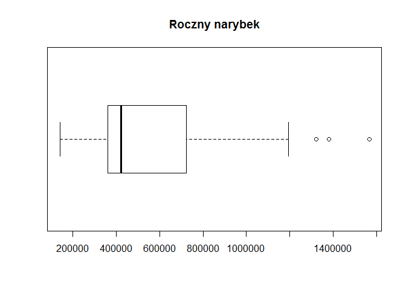

-   [Wprowadzenie](#wprowadzenie)
-   [Podsumowanie analizy](#podsumowanie-analizy)
-   [Ładowanie oraz struktura danych](#adowanie-oraz-struktura-danych)
-   [Analiza rozkładu atrybutów](#analiza-rozkadu-atrybutow)
-   [Wartości puste](#wartosci-puste)
-   [Analiza wartości atrybutów](#analiza-wartosci-atrybutow)
-   [Analiza korelacji](#analiza-korelacji)
-   [Prezentacja zmiany rozmiaru śledzi w czasie](#prezentacja-zmiany-rozmiaru-sledzi-w-czasie)
-   [Regresor przewidujący rozmiar śledzia](#regresor-przewidujacy-rozmiar-sledzia)
-   [Analiza ważności atrybutów](#analiza-waznosci-atrybutow)

Wprowadzenie
============

Celem projektu jest analiza zbioru danych dotyczących połowu śledzia oceanicznego w Europie oraz próba określenia głównych przyczyn stopniowego zmniejszania się długości śledzi. Pomiary zawierają obserwacje z ostatnich 60 lat. Wiersze są uporządkowane chronologicznie.

Zbiór danych zawiera 52582 obserwacji opisanych 16 cechami.

Podsumowanie analizy
====================

Podczas analizy, ze zbioru, usunięte zostały wartości brakujące. Przeprowadzona została interpretacja wartości cech i korelacji między nimi. W trakcie badań zależności określono, że długość śledzia jest powiązana w dużym stopniu ze zmianą temperatury przy powierzchni wody i zjawiskiem oscylacji północnoatlantyckiej. W kolejnym kroku utworzony został model predykcji długości ryby w postaci regresora za pomocą algorytmu RandomForest. W projekcie zbadano ważność atrybutów podczas predykcji, co pomogło określić przyczyny spadku długości śledzia wyławianego w Europie:

-   wzrost temperatury wskutek dodatniej fazy oscylacji północnoatlantyckiej
-   spadek dostępności pożywienia
-   spadek liczby małych ryb (narybku)

Ładowanie oraz struktura danych
===============================

``` r
#load libraries
library(knitr)       # report generation
library(dplyr)       # data manipulation
library(ggplot2)     # plots visualisation
library(gridExtra)   # multiple plots on grid
library(corrplot)    # correlation matrix visualisation
library(plotly)      # interactive plots
library(caret)       # data exploration lib
library(randomForest)# rf
```

``` r
rawCSV <- read.csv("sledzie.csv", na.strings = "?")
str(rawCSV)
```

    ## 'data.frame':    52582 obs. of  16 variables:
    ##  $ X     : int  0 1 2 3 4 5 6 7 8 9 ...
    ##  $ length: num  23 22.5 25 25.5 24 22 24 23.5 22.5 22.5 ...
    ##  $ cfin1 : num  0.0278 0.0278 0.0278 0.0278 0.0278 ...
    ##  $ cfin2 : num  0.278 0.278 0.278 0.278 0.278 ...
    ##  $ chel1 : num  2.47 2.47 2.47 2.47 2.47 ...
    ##  $ chel2 : num  NA 21.4 21.4 21.4 21.4 ...
    ##  $ lcop1 : num  2.55 2.55 2.55 2.55 2.55 ...
    ##  $ lcop2 : num  26.4 26.4 26.4 26.4 26.4 ...
    ##  $ fbar  : num  0.356 0.356 0.356 0.356 0.356 0.356 0.356 0.356 0.356 0.356 ...
    ##  $ recr  : int  482831 482831 482831 482831 482831 482831 482831 482831 482831 482831 ...
    ##  $ cumf  : num  0.306 0.306 0.306 0.306 0.306 ...
    ##  $ totaln: num  267381 267381 267381 267381 267381 ...
    ##  $ sst   : num  14.3 14.3 14.3 14.3 14.3 ...
    ##  $ sal   : num  35.5 35.5 35.5 35.5 35.5 ...
    ##  $ xmonth: int  7 7 7 7 7 7 7 7 7 7 ...
    ##  $ nao   : num  2.8 2.8 2.8 2.8 2.8 2.8 2.8 2.8 2.8 2.8 ...

Zbiór danych zawiera 52582 obserwacje opisane 16 atrybutami:

<table style="width:76%;">
<colgroup>
<col width="13%" />
<col width="62%" />
</colgroup>
<thead>
<tr class="header">
<th>Nazwa atrybutu</th>
<th>Opis</th>
</tr>
</thead>
<tbody>
<tr class="odd">
<td>length</td>
<td>długość złowionego śledzia [cm]</td>
</tr>
<tr class="even">
<td>cfin1</td>
<td>dostępność planktonu [zagęszczenie Calanus finmarchicus gat. 1]</td>
</tr>
<tr class="odd">
<td>cfin2</td>
<td>dostępność planktonu [zagęszczenie Calanus finmarchicus gat. 2]</td>
</tr>
<tr class="even">
<td>chel1</td>
<td>dostępność planktonu [zagęszczenie Calanus helgolandicus gat. 1]</td>
</tr>
<tr class="odd">
<td>chel2</td>
<td>dostępność planktonu [zagęszczenie Calanus helgolandicus gat. 2]</td>
</tr>
<tr class="even">
<td>lcop1</td>
<td>dostępność planktonu [zagęszczenie widłonogów gat. 1]</td>
</tr>
<tr class="odd">
<td>lcop2</td>
<td>dostępność planktonu [zagęszczenie widłonogów gat. 2]</td>
</tr>
<tr class="even">
<td>fbar</td>
<td>natężenie połowów w regionie [ułamek pozostawionego narybku]</td>
</tr>
<tr class="odd">
<td>recr</td>
<td>roczny narybek [liczba śledzi]</td>
</tr>
<tr class="even">
<td>cumf</td>
<td>łączne roczne natężenie połowów w regionie [ułamek pozostawionego narybku]</td>
</tr>
<tr class="odd">
<td>totaln</td>
<td>łączna liczba ryb złowionych w ramach połowu [liczba śledzi]</td>
</tr>
<tr class="even">
<td>sst</td>
<td>temperatura przy powierzchni wody [°C]</td>
</tr>
<tr class="odd">
<td>sal</td>
<td>poziom zasolenia wody [Knudsen ppt]</td>
</tr>
<tr class="even">
<td>xmonth</td>
<td>miesiąc połowu [numer miesiąca]</td>
</tr>
<tr class="odd">
<td>nao</td>
<td>oscylacja północnoatlantycka [mb]</td>
</tr>
</tbody>
</table>

Analiza rozkładu atrybutów
==========================

Krótkie podsumowanie statystyk wartości atrybutów:

``` r
summary(rawCSV[-1])
```

    ##      length         cfin1             cfin2             chel1       
    ##  Min.   :19.0   Min.   : 0.0000   Min.   : 0.0000   Min.   : 0.000  
    ##  1st Qu.:24.0   1st Qu.: 0.0000   1st Qu.: 0.2778   1st Qu.: 2.469  
    ##  Median :25.5   Median : 0.1111   Median : 0.7012   Median : 5.750  
    ##  Mean   :25.3   Mean   : 0.4458   Mean   : 2.0248   Mean   :10.006  
    ##  3rd Qu.:26.5   3rd Qu.: 0.3333   3rd Qu.: 1.7936   3rd Qu.:11.500  
    ##  Max.   :32.5   Max.   :37.6667   Max.   :19.3958   Max.   :75.000  
    ##                 NA's   :1581      NA's   :1536      NA's   :1555    
    ##      chel2            lcop1              lcop2             fbar       
    ##  Min.   : 5.238   Min.   :  0.3074   Min.   : 7.849   Min.   :0.0680  
    ##  1st Qu.:13.427   1st Qu.:  2.5479   1st Qu.:17.808   1st Qu.:0.2270  
    ##  Median :21.673   Median :  7.0000   Median :24.859   Median :0.3320  
    ##  Mean   :21.221   Mean   : 12.8108   Mean   :28.419   Mean   :0.3304  
    ##  3rd Qu.:27.193   3rd Qu.: 21.2315   3rd Qu.:37.232   3rd Qu.:0.4560  
    ##  Max.   :57.706   Max.   :115.5833   Max.   :68.736   Max.   :0.8490  
    ##  NA's   :1556     NA's   :1653       NA's   :1591                     
    ##       recr              cumf             totaln             sst       
    ##  Min.   : 140515   Min.   :0.06833   Min.   : 144137   Min.   :12.77  
    ##  1st Qu.: 360061   1st Qu.:0.14809   1st Qu.: 306068   1st Qu.:13.60  
    ##  Median : 421391   Median :0.23191   Median : 539558   Median :13.86  
    ##  Mean   : 520367   Mean   :0.22981   Mean   : 514973   Mean   :13.87  
    ##  3rd Qu.: 724151   3rd Qu.:0.29803   3rd Qu.: 730351   3rd Qu.:14.16  
    ##  Max.   :1565890   Max.   :0.39801   Max.   :1015595   Max.   :14.73  
    ##                                                        NA's   :1584   
    ##       sal            xmonth            nao          
    ##  Min.   :35.40   Min.   : 1.000   Min.   :-4.89000  
    ##  1st Qu.:35.51   1st Qu.: 5.000   1st Qu.:-1.89000  
    ##  Median :35.51   Median : 8.000   Median : 0.20000  
    ##  Mean   :35.51   Mean   : 7.258   Mean   :-0.09236  
    ##  3rd Qu.:35.52   3rd Qu.: 9.000   3rd Qu.: 1.63000  
    ##  Max.   :35.61   Max.   :12.000   Max.   : 5.08000  
    ## 

Wartości puste
==============

Zbiór danych opisujący połów śledzi zawiera 10094 niepełnych obserwacji. Cały zbiór składa się z jedynie 52582 pomiarów, odrzucając tak dużą część danych zostałyby utracone istotne informacje.

Na podstawie podsumowania statystyk kolejnych atrybutów można zauważyć, że brakujące wartości występują jedynie w cechach opisujących:

-   dostępność planktonu (cfin1, cfin2, chel1, chel2, lcop1, lcop2),
-   temperaturę przy powierzchni wody (sst).

W zbiorze danych warto zwrócić uwagę, że wartości atrybutów najczęściej występują w podobnych grupach. Dla przedstawienia tej zależności wybrano przykładowe trzy podzbiory sąsiadujących ze sobą elementów:

``` r
rawCSV[c(1:5, 1001:1005, 20001:20005), ]
```

    ##           X length   cfin1    cfin2    chel1    chel2    lcop1    lcop2
    ## 1         0   23.0 0.02778  0.27785  2.46875       NA  2.54787 26.35881
    ## 2         1   22.5 0.02778  0.27785  2.46875 21.43548  2.54787 26.35881
    ## 3         2   25.0 0.02778  0.27785  2.46875 21.43548  2.54787 26.35881
    ## 4         3   25.5 0.02778  0.27785  2.46875 21.43548  2.54787 26.35881
    ## 5         4   24.0 0.02778  0.27785  2.46875 21.43548  2.54787 26.35881
    ## 1001   1000   26.5 2.14333  0.29600  6.38667 21.67333  9.01000 24.85867
    ## 1002   1001   25.0 2.14333  0.29600  6.38667 21.67333  9.01000 24.85867
    ## 1003   1002   25.5 2.14333  0.29600  6.38667 21.67333  9.01000 24.85867
    ## 1004   1003   23.5 2.14333  0.29600  6.38667 21.67333       NA 24.85867
    ## 1005   1004   24.5 2.14333  4.45882  6.38667 26.17187  9.01000 32.19090
    ## 20001 20000   26.0 0.20536 19.39583       NA 32.64940 11.77679 65.51964
    ## 20002 20001   28.0 0.20536 19.39583 11.24554 32.64940 11.77679 65.51964
    ## 20003 20002   26.0 0.20536 19.39583 11.24554 32.64940 11.77679 65.51964
    ## 20004 20003   25.5 0.20536 19.39583 11.24554 32.64940 11.77679 65.51964
    ## 20005 20004   23.5 0.20536 19.39583 11.24554 32.64940 11.77679 65.51964
    ##        fbar   recr      cumf   totaln      sst      sal xmonth   nao
    ## 1     0.356 482831 0.3059879 267380.8 14.30693 35.51234      7  2.80
    ## 2     0.356 482831 0.3059879 267380.8 14.30693 35.51234      7  2.80
    ## 3     0.356 482831 0.3059879 267380.8 14.30693 35.51234      7  2.80
    ## 4     0.356 482831 0.3059879 267380.8 14.30693 35.51234      7  2.80
    ## 5     0.356 482831 0.3059879 267380.8 14.30693 35.51234      7  2.80
    ## 1001  0.158 392084 0.1100757 766077.6 14.06933 35.51526      5 -1.54
    ## 1002  0.158 392084 0.1100757 766077.6 14.06933 35.51526      5 -1.54
    ## 1003  0.158 392084 0.1100757 766077.6 14.06933 35.51526      5 -1.54
    ## 1004  0.158 392084 0.1100757 766077.6 14.06933 35.51526      5 -1.54
    ## 1005  0.327 783337 0.3096315 492519.0 13.98133 35.61240     10  0.80
    ## 20001 0.467 168531 0.3854825 201854.9 13.19707 35.47843     12 -2.25
    ## 20002 0.467 168531 0.3854825 201854.9 13.19707 35.47843     12 -2.25
    ## 20003 0.467 168531 0.3854825 201854.9 13.19707 35.47843     12 -2.25
    ## 20004 0.467 168531 0.3854825 201854.9 13.19707 35.47843     12 -2.25
    ## 20005 0.467 168531 0.3854825 201854.9 13.19707 35.47843     12 -2.25

Widać wyraźnie, że sąsiadujące ze sobą elementy mają prawie zawsze identyczne wartości na atrybutach cfin1, cfin2, chel1, chel2, lcop1, lcop2, fbar, recr, cumf, totaln, sst, sal, xmonth, nao, a różnice są niewielkie. W pierwszej obserwacji (X=1) cechę 'chel2', na pierwszy rzut oka, możnaby uzupełnić o wartość 21.43548. Podobnie w 1004 wierszu lcop na 9.01000 itd.

Do uzupełnienia wartości pustych wybrane zostaną wiersze posiadające grupy podobne do uzupełnianego wiersza. Następnie z podobnych grup wyznaczona zostanie mediana dla danej wartości.

``` r
#Uproszczony algorytm wyznaczania grup podobnych i mediany do uzupełnienia wartości pustych (przykład dla atrybutu sst)
df <- rawCSV[is.na(rawCSV$sst), ]
for(i in 1:nrow(df)){
  row <- df[i,]
  #wyznaczanie grup podobnych na podstawie atrybutów totaln, sal, xmonth oraz nao
  similarGroups <- rawCSV[
      rawCSV$totaln == row$totaln &
      rawCSV$sal == row$sal &
      rawCSV$xmonth == row$xmonth &
      rawCSV$nao == row$nao, ]
  #przypisanie mediany
  df[i,]$sst <- median(similarGroups$sst, na.rm = TRUE)
}
```

Statystyki zbioru po wypełnieniu wartości pustych:

``` r
summary(withoutMissing[-1])
```

    ##      length         cfin1             cfin2             chel1       
    ##  Min.   :19.0   Min.   : 0.0000   Min.   : 0.0000   Min.   : 0.000  
    ##  1st Qu.:24.0   1st Qu.: 0.0000   1st Qu.: 0.2778   1st Qu.: 2.469  
    ##  Median :25.5   Median : 0.1111   Median : 0.7012   Median : 5.750  
    ##  Mean   :25.3   Mean   : 0.4439   Mean   : 2.0261   Mean   : 9.960  
    ##  3rd Qu.:26.5   3rd Qu.: 0.3333   3rd Qu.: 1.7936   3rd Qu.:11.500  
    ##  Max.   :32.5   Max.   :37.6667   Max.   :19.3958   Max.   :75.000  
    ##      chel2            lcop1              lcop2             fbar       
    ##  Min.   : 5.238   Min.   :  0.3074   Min.   : 7.849   Min.   :0.0680  
    ##  1st Qu.:13.589   1st Qu.:  2.5479   1st Qu.:17.808   1st Qu.:0.2270  
    ##  Median :21.673   Median :  7.0717   Median :24.859   Median :0.3320  
    ##  Mean   :21.209   Mean   : 12.7327   Mean   :28.417   Mean   :0.3304  
    ##  3rd Qu.:27.193   3rd Qu.: 21.2315   3rd Qu.:37.232   3rd Qu.:0.4560  
    ##  Max.   :57.706   Max.   :115.5833   Max.   :68.736   Max.   :0.8490  
    ##       recr              cumf             totaln             sst       
    ##  Min.   : 140515   Min.   :0.06833   Min.   : 144137   Min.   :12.77  
    ##  1st Qu.: 360061   1st Qu.:0.14809   1st Qu.: 306068   1st Qu.:13.60  
    ##  Median : 421391   Median :0.23191   Median : 539558   Median :13.86  
    ##  Mean   : 520367   Mean   :0.22981   Mean   : 514973   Mean   :13.87  
    ##  3rd Qu.: 724151   3rd Qu.:0.29803   3rd Qu.: 730351   3rd Qu.:14.16  
    ##  Max.   :1565890   Max.   :0.39801   Max.   :1015595   Max.   :14.73  
    ##       sal            xmonth            nao          
    ##  Min.   :35.40   Min.   : 1.000   Min.   :-4.89000  
    ##  1st Qu.:35.51   1st Qu.: 5.000   1st Qu.:-1.89000  
    ##  Median :35.51   Median : 8.000   Median : 0.20000  
    ##  Mean   :35.51   Mean   : 7.258   Mean   :-0.09236  
    ##  3rd Qu.:35.52   3rd Qu.: 9.000   3rd Qu.: 1.63000  
    ##  Max.   :35.61   Max.   :12.000   Max.   : 5.08000

Analiza wartości atrybutów
==========================

``` r
boxplot(withoutMissing$length, horizontal=TRUE, main="Długość śledzia")
```


``` r
boxplot(withoutMissing[,3:8], main="Dostępność planktonu", 
        names=c("Calanus finmarchicus", "Calanus finmarchicus", "Calanus helgolandicus", "Calanus helgolandicus", "widłonogi", "widłonogi"))
```


``` r
boxplot(withoutMissing$fbar, horizontal=TRUE, main="Natężenie połowów w regionie")
```


``` r
boxplot(withoutMissing$recr, horizontal=TRUE, main="Roczny narybek")
```



``` r
boxplot(withoutMissing$cumf, horizontal=TRUE, main="Łączne roczne natężenie połowów w regionie")
```


``` r
boxplot(withoutMissing$totaln, horizontal=TRUE, main="Łączna liczba ryb złowionych w ramach połowu")
```


``` r
boxplot(withoutMissing$sst, horizontal=TRUE, main="Temperatura przy powierzchni wody")
```


``` r
boxplot(withoutMissing$sal, horizontal=TRUE, main="Poziom zasolenia wody")
```


``` r
boxplot(withoutMissing$nao, horizontal=TRUE, main="Oscylacja północnoatlantycka")
```


Analiza korelacji
=================

Analizę związków pomiędzy atrybutami dokonano za pomocą wizualizacji macierzy korelacji.

``` r
corMatrix <- cor(withoutMissing)
corrplot(corMatrix, method = "square")
```


Na wykresie można zauważyć silną korelację ujemną między długością śledzia (length), a temperaturą przy powierzchni (sst). Wielkość ryb zależy również od oscylacji północnoatlantyckiej (nao).

Oscylacja Północnoatlantycka to zjawisko meteorologiczne, które ma wpływ na klimat i jest związane ze zmianami cyrkulacji powietrza i wód, ze zmianami ciśnienia oraz temperatury. Można to zauważyć na macierzy - temperatura przy powierzchni jest silnie dodatnio skorelowana z NAO. Ujemna korelacja oznacza, że wyższa temperatura oraz dodatnia faza NAO wpływa na zmiejszenie się długości łowionych śledzi.

Rozmiar śledzia jest także skorelowany z intensywnościa połowów oraz dostępnością planktonu (chel1 - Calanus helgolandicus gat. 1 i lcop1 - widłonogów gat. 1).

``` r
ggplot(withoutMissing, aes(x=sst, y=length)) + geom_point() + geom_smooth() + theme_bw()
```


Prezentacja zmiany rozmiaru śledzi w czasie
===========================================

Dane w zbiorze są uporządkowane chronolicznie, dlatego jako atrybut X zostanie przedstawiony jako zmiana czasu. Do prezentacji wybrano próbkę 5% ze zbioru, aby wykres interaktywny działał w sposób płynny.

``` r
partition <- createDataPartition(y=withoutMissing$length, p=.05, list=FALSE)
dfPartition <- withoutMissing[partition, ]
p <- ggplot(dfPartition, aes(x=X, y=length)) + geom_point() + geom_smooth() + theme_bw()
ggplotly(p)
```

<!--html_preserve-->

<script type="application/json" data-for="htmlwidget-e1e03864fe19d6ccbd62">{"x":{"data":[{"x":[22,27,44,51,93,117,153,155,182,224,241,260,262,268,279,296,314,322,358,376,407,422,431,450,451,462,478,483,490,494,553,566,594,600,620,658,667,675,678,700,723,729,774,813,822,824,841,842,863,989,1004,1019,1026,1036,1042,1044,1060,1061,1063,1064,1065,1070,1113,1149,1185,1221,1222,1224,1226,1227,1262,1273,1286,1289,1322,1350,1393,1401,1402,1407,1445,1451,1498,1523,1542,1548,1574,1596,1604,1608,1610,1615,1655,1698,1704,1769,1775,1809,1833,1841,1871,1890,1931,1934,1962,1980,1985,2039,2062,2131,2135,2146,2159,2168,2182,2191,2226,2234,2254,2281,2290,2348,2376,2430,2441,2458,2470,2473,2500,2554,2562,2648,2656,2713,2732,2748,2771,2786,2788,2805,2905,2911,2936,2955,2956,2960,2974,2981,3031,3039,3050,3071,3077,3090,3115,3126,3154,3165,3208,3216,3224,3231,3250,3272,3280,3325,3326,3330,3338,3373,3390,3399,3400,3406,3411,3420,3426,3476,3492,3514,3515,3562,3563,3590,3614,3628,3631,3647,3685,3696,3700,3705,3752,3774,3778,3810,3844,3850,3877,3888,3898,3909,3910,3943,3988,4024,4052,4053,4065,4071,4133,4144,4164,4166,4233,4247,4265,4271,4281,4305,4370,4389,4399,4401,4412,4537,4582,4596,4656,4668,4669,4676,4687,4703,4735,4749,4752,4754,4773,4782,4787,4799,4806,4812,4878,4910,4913,4919,4921,4971,4979,5014,5020,5037,5044,5072,5096,5128,5157,5164,5165,5187,5194,5206,5209,5210,5230,5237,5248,5257,5280,5282,5284,5296,5302,5310,5318,5320,5341,5344,5354,5380,5407,5432,5453,5475,5506,5528,5529,5538,5542,5544,5562,5569,5574,5579,5591,5603,5606,5636,5644,5663,5698,5706,5708,5779,5787,5836,5853,5860,5920,5937,5944,5973,5977,5984,5992,6008,6018,6019,6023,6062,6064,6101,6114,6128,6151,6156,6168,6180,6188,6205,6223,6231,6236,6244,6249,6283,6375,6433,6461,6489,6538,6541,6552,6578,6610,6633,6667,6772,6800,6822,6825,6851,6862,6897,6924,6943,6963,7040,7073,7082,7127,7162,7169,7201,7225,7230,7235,7238,7295,7306,7313,7316,7328,7372,7429,7444,7447,7452,7492,7534,7536,7544,7578,7581,7583,7585,7618,7662,7672,7728,7739,7742,7747,7748,7769,7773,7780,7784,7796,7799,7847,7878,7938,7945,7948,7988,8014,8024,8157,8166,8177,8179,8198,8280,8307,8309,8311,8319,8322,8329,8338,8378,8387,8414,8436,8458,8463,8466,8482,8505,8523,8528,8541,8560,8562,8582,8593,8605,8609,8616,8632,8646,8726,8757,8769,8775,8797,8823,8835,8844,8845,8860,8870,8876,8882,8945,8951,8955,8960,8988,8991,9005,9017,9048,9050,9065,9074,9086,9094,9095,9102,9127,9192,9210,9250,9255,9265,9267,9273,9301,9386,9405,9439,9449,9481,9484,9513,9538,9562,9580,9593,9631,9652,9670,9698,9740,9770,9772,9801,9820,9822,9823,9850,9869,9891,9919,9925,9939,10004,10013,10023,10027,10100,10111,10123,10166,10188,10189,10209,10357,10361,10370,10381,10427,10459,10476,10484,10494,10524,10528,10553,10560,10562,10565,10568,10589,10607,10609,10611,10633,10652,10674,10685,10694,10706,10720,10734,10744,10758,10777,10789,10799,10802,10810,10813,10836,10908,10920,10923,10935,10996,11002,11008,11033,11062,11069,11093,11155,11156,11207,11280,11289,11334,11368,11370,11423,11434,11449,11454,11471,11483,11484,11489,11500,11519,11529,11542,11552,11585,11587,11597,11602,11616,11627,11637,11703,11788,11794,11801,11821,11852,11872,11889,11913,11930,11961,11997,12001,12015,12050,12105,12148,12163,12185,12216,12272,12325,12353,12376,12388,12414,12431,12441,12443,12452,12457,12465,12536,12549,12583,12605,12640,12649,12664,12707,12736,12769,12779,12781,12782,12829,12834,12861,12870,12871,12887,12924,12946,12962,12966,12979,12981,13001,13044,13064,13089,13111,13116,13121,13145,13165,13169,13177,13184,13198,13203,13241,13245,13271,13311,13356,13359,13364,13373,13379,13386,13388,13398,13411,13446,13454,13462,13487,13495,13520,13533,13564,13568,13575,13577,13618,13631,13685,13699,13703,13730,13764,13772,13779,13819,13830,13872,13879,13880,13922,13937,13940,13952,13965,13971,13989,14050,14076,14092,14097,14163,14242,14293,14294,14318,14357,14379,14396,14406,14450,14451,14457,14488,14525,14546,14558,14662,14669,14676,14677,14679,14689,14710,14713,14811,14838,14870,14889,14890,14907,14921,14929,14930,14948,14950,14993,15002,15011,15018,15028,15029,15060,15137,15163,15177,15207,15233,15265,15271,15327,15336,15367,15377,15401,15407,15462,15468,15475,15479,15495,15498,15499,15500,15511,15524,15563,15624,15628,15631,15672,15677,15771,15792,15814,15884,15888,15993,16008,16011,16032,16055,16072,16085,16110,16113,16154,16158,16172,16173,16175,16176,16248,16258,16267,16280,16315,16324,16352,16362,16394,16423,16425,16465,16497,16508,16531,16534,16538,16556,16561,16634,16676,16689,16694,16707,16714,16718,16752,16766,16792,16812,16845,16899,16907,16919,16924,16928,16962,16966,16967,16981,17046,17051,17077,17097,17117,17132,17142,17173,17191,17197,17255,17289,17293,17309,17311,17326,17342,17348,17360,17363,17368,17389,17421,17426,17427,17453,17465,17520,17574,17582,17598,17599,17603,17608,17623,17671,17697,17714,17731,17734,17738,17767,17797,17799,17808,17817,17858,17859,17862,17985,18010,18079,18119,18142,18169,18178,18183,18189,18215,18225,18259,18284,18292,18305,18339,18354,18374,18397,18415,18417,18420,18445,18473,18487,18521,18552,18568,18569,18574,18586,18631,18645,18659,18662,18728,18736,18739,18767,18829,18837,18866,18893,18897,18902,18918,18929,18935,18936,18945,18958,18976,18977,18992,18994,19003,19021,19050,19058,19095,19129,19147,19179,19186,19189,19221,19229,19248,19282,19300,19316,19353,19385,19389,19400,19401,19421,19452,19472,19505,19561,19571,19575,19579,19601,19636,19641,19643,19650,19665,19725,19738,19755,19773,19810,19849,19872,19894,19902,19923,19929,19953,19993,20004,20007,20032,20093,20138,20144,20169,20192,20217,20230,20255,20289,20294,20301,20313,20359,20392,20400,20413,20433,20440,20465,20551,20579,20580,20585,20617,20675,20742,20762,20768,20782,20831,20868,20896,20932,20964,20982,20983,21013,21050,21064,21142,21172,21199,21214,21232,21276,21283,21322,21323,21326,21327,21351,21353,21366,21391,21432,21485,21514,21517,21538,21551,21580,21592,21595,21601,21605,21610,21627,21628,21641,21652,21655,21661,21662,21699,21702,21713,21716,21725,21731,21772,21788,21800,21813,21839,21861,21883,21925,21932,21987,22004,22027,22126,22127,22147,22157,22165,22166,22181,22203,22210,22254,22257,22276,22301,22307,22317,22343,22368,22369,22379,22393,22405,22411,22413,22435,22453,22455,22456,22461,22481,22486,22511,22515,22518,22519,22536,22554,22582,22588,22600,22628,22652,22658,22676,22678,22680,22689,22705,22708,22715,22719,22731,22756,22813,22818,22823,22849,22872,22914,22916,22921,22941,22962,22978,22986,23048,23072,23144,23204,23243,23245,23288,23322,23332,23350,23361,23367,23408,23418,23422,23440,23476,23485,23490,23491,23506,23543,23589,23605,23615,23618,23631,23638,23640,23679,23695,23717,23769,23787,23790,23806,23811,23851,23861,23884,23891,23903,23915,23946,23952,23982,23995,24003,24027,24060,24069,24071,24072,24083,24098,24104,24119,24130,24147,24166,24171,24176,24208,24209,24221,24222,24227,24251,24265,24284,24288,24297,24332,24356,24374,24410,24432,24452,24505,24546,24554,24589,24609,24610,24611,24614,24682,24686,24719,24739,24742,24762,24809,24837,24854,24870,24889,24890,24902,25005,25010,25018,25045,25064,25098,25128,25136,25160,25161,25177,25178,25179,25259,25267,25268,25274,25296,25330,25376,25389,25465,25475,25494,25513,25527,25538,25541,25576,25601,25617,25649,25651,25654,25656,25657,25673,25696,25719,25723,25729,25740,25741,25759,25760,25785,25864,25882,25885,25909,25914,25931,25937,25938,25948,25966,25983,25991,25992,26000,26002,26027,26061,26075,26111,26115,26140,26170,26248,26301,26345,26376,26378,26458,26484,26485,26523,26549,26580,26592,26603,26617,26629,26668,26697,26746,26762,26772,26773,26781,26783,26786,26869,26871,26910,26941,26944,26964,26990,26992,26998,27023,27047,27049,27068,27075,27088,27091,27122,27131,27146,27154,27167,27210,27231,27303,27315,27324,27352,27387,27395,27426,27454,27458,27496,27498,27518,27531,27540,27566,27582,27608,27616,27635,27641,27663,27792,27794,27804,27808,27833,27872,27878,27884,27891,27943,27958,27997,28028,28041,28046,28060,28103,28115,28137,28165,28166,28179,28200,28214,28224,28250,28298,28319,28338,28408,28427,28454,28462,28489,28494,28516,28559,28568,28639,28640,28645,28663,28700,28738,28743,28764,28765,28790,28809,28825,28836,28857,28859,28860,28883,28901,28907,28971,28980,28994,29036,29054,29071,29073,29079,29150,29159,29213,29220,29239,29249,29254,29278,29382,29388,29392,29393,29407,29434,29461,29479,29495,29522,29528,29552,29568,29572,29574,29576,29581,29608,29673,29702,29709,29779,29786,29866,29894,29938,29947,29957,29994,30063,30090,30109,30111,30115,30118,30129,30185,30198,30204,30243,30384,30435,30458,30471,30537,30557,30574,30576,30594,30601,30615,30659,30672,30699,30711,30724,30742,30770,30781,30793,30797,30821,30842,30845,30853,30854,30860,30950,30967,30990,31030,31057,31058,31059,31091,31099,31152,31186,31196,31210,31228,31233,31243,31280,31282,31283,31290,31312,31323,31325,31341,31360,31375,31435,31454,31496,31507,31520,31521,31568,31584,31683,31694,31703,31741,31801,31825,31850,31851,31854,31875,31920,31949,31958,31966,32052,32071,32078,32111,32133,32147,32152,32161,32167,32168,32172,32243,32247,32295,32302,32337,32338,32350,32351,32356,32358,32401,32402,32425,32444,32453,32504,32520,32530,32540,32552,32558,32586,32633,32640,32650,32655,32696,32724,32730,32777,32795,32803,32851,32880,32881,32903,32905,32911,32941,32955,32967,32970,32987,33005,33020,33040,33051,33063,33081,33082,33152,33187,33198,33208,33228,33229,33251,33267,33275,33352,33385,33390,33400,33444,33446,33447,33480,33483,33486,33488,33540,33547,33609,33612,33628,33661,33680,33698,33707,33719,33741,33751,33761,33773,33797,33812,33835,33837,33854,33858,33885,33893,33895,33905,33917,33935,33948,34029,34063,34095,34096,34102,34134,34136,34147,34163,34181,34214,34221,34237,34245,34275,34350,34367,34377,34394,34472,34486,34487,34498,34501,34505,34529,34553,34593,34599,34600,34610,34644,34655,34688,34703,34724,34745,34747,34785,34799,34815,34835,34852,34884,34888,34952,34975,35010,35023,35034,35049,35055,35062,35079,35084,35096,35112,35132,35142,35146,35163,35180,35183,35196,35209,35215,35256,35266,35304,35314,35365,35381,35410,35412,35437,35478,35510,35522,35553,35598,35611,35623,35645,35712,35757,35765,35783,35805,35818,35897,35928,35933,35963,35995,36022,36029,36041,36048,36049,36105,36140,36166,36169,36174,36197,36213,36247,36315,36330,36335,36337,36338,36365,36381,36411,36427,36465,36486,36498,36512,36520,36552,36571,36579,36601,36623,36646,36659,36678,36682,36691,36700,36710,36711,36720,36727,36752,36780,36785,36828,36830,36836,36842,36909,36924,37001,37009,37012,37031,37053,37057,37100,37127,37152,37161,37162,37183,37194,37207,37212,37224,37240,37282,37294,37306,37366,37369,37373,37374,37396,37412,37428,37474,37483,37485,37486,37515,37523,37552,37562,37568,37573,37578,37612,37624,37633,37666,37671,37681,37723,37734,37742,37759,37770,37818,37853,37866,37884,37903,37905,37958,37984,38000,38005,38034,38047,38054,38060,38064,38126,38157,38163,38172,38256,38273,38317,38336,38339,38378,38398,38400,38438,38490,38535,38580,38588,38611,38640,38659,38660,38684,38726,38740,38741,38755,38796,38821,38832,38839,38841,38846,38871,38872,38873,38909,38917,38962,38970,39009,39035,39042,39043,39069,39079,39090,39091,39118,39159,39166,39209,39224,39289,39372,39378,39385,39404,39427,39466,39473,39482,39497,39499,39510,39544,39547,39551,39557,39567,39570,39571,39585,39609,39622,39633,39645,39675,39683,39692,39718,39721,39807,39813,39833,39834,39865,39868,39897,39918,39947,40065,40080,40081,40089,40138,40212,40239,40250,40252,40267,40279,40280,40281,40294,40297,40301,40308,40318,40349,40376,40378,40388,40415,40433,40449,40451,40479,40491,40495,40531,40532,40564,40568,40588,40624,40626,40649,40658,40661,40669,40691,40696,40711,40735,40740,40771,40775,40795,40857,40881,40924,40953,40984,40998,41042,41130,41133,41139,41153,41163,41173,41191,41192,41267,41274,41288,41319,41321,41322,41377,41413,41427,41435,41446,41466,41504,41515,41529,41555,41595,41618,41630,41645,41670,41679,41701,41726,41728,41737,41764,41789,41797,41866,41922,41946,42007,42133,42153,42163,42180,42209,42234,42264,42306,42317,42320,42324,42328,42335,42338,42340,42368,42392,42393,42403,42430,42461,42464,42469,42492,42494,42530,42533,42573,42599,42614,42630,42684,42698,42714,42715,42716,42749,42752,42853,42884,42895,42915,42940,42998,43012,43015,43016,43021,43051,43074,43108,43134,43149,43170,43171,43173,43203,43236,43272,43281,43309,43316,43338,43365,43367,43370,43372,43400,43407,43408,43411,43430,43437,43438,43448,43455,43520,43561,43564,43565,43600,43623,43634,43650,43674,43695,43707,43737,43745,43747,43765,43790,43812,43844,43877,43913,43939,43942,43960,43970,44002,44010,44066,44073,44078,44117,44147,44159,44206,44221,44224,44225,44234,44244,44272,44277,44278,44279,44297,44308,44316,44319,44325,44353,44370,44380,44384,44395,44402,44409,44411,44434,44448,44450,44453,44497,44510,44533,44539,44566,44578,44601,44629,44634,44659,44678,44689,44698,44699,44720,44740,44759,44799,44808,44816,44821,44840,44849,44868,44871,44907,44938,44955,44988,45066,45071,45091,45099,45103,45137,45144,45160,45163,45195,45239,45268,45270,45292,45318,45330,45339,45344,45404,45451,45457,45495,45498,45529,45532,45535,45556,45579,45594,45605,45628,45794,45813,45826,45856,45871,45897,45926,45937,45949,45965,45969,45972,45989,46000,46009,46020,46023,46039,46102,46129,46135,46148,46184,46208,46215,46234,46248,46250,46256,46267,46272,46281,46367,46398,46433,46453,46466,46479,46524,46526,46535,46593,46594,46612,46656,46679,46689,46696,46697,46704,46705,46709,46730,46748,46786,46816,46855,46888,46889,46897,46902,46916,46946,46958,46989,47038,47044,47113,47122,47146,47150,47184,47314,47337,47372,47373,47385,47390,47391,47400,47458,47474,47475,47491,47500,47521,47595,47618,47662,47679,47718,47740,47765,47797,47813,47814,47839,47847,47864,47877,47890,47899,47938,47984,47988,48000,48012,48039,48046,48048,48088,48096,48103,48124,48125,48144,48179,48191,48233,48244,48269,48282,48285,48299,48325,48340,48342,48357,48372,48409,48461,48470,48471,48525,48529,48587,48603,48606,48624,48678,48688,48690,48693,48719,48743,48771,48774,48778,48814,48856,48863,48880,48908,48918,48954,48971,49025,49035,49040,49094,49125,49128,49132,49166,49187,49205,49208,49237,49259,49264,49268,49269,49279,49303,49324,49326,49347,49408,49416,49422,49424,49449,49454,49461,49515,49553,49554,49563,49582,49635,49698,49703,49723,49737,49779,49815,49824,49825,49832,49839,49876,49902,49938,49941,49951,49960,49972,50017,50032,50040,50042,50060,50063,50132,50144,50150,50154,50156,50157,50177,50188,50196,50198,50246,50262,50279,50290,50300,50302,50319,50349,50353,50384,50399,50443,50447,50448,50454,50476,50517,50552,50564,50603,50606,50612,50621,50629,50637,50639,50648,50670,50732,50773,50825,50869,50875,50876,50880,50913,50932,50944,50961,50990,51003,51005,51025,51056,51078,51106,51129,51135,51152,51155,51170,51176,51225,51233,51284,51303,51335,51340,51346,51358,51393,51412,51413,51418,51445,51451,51454,51467,51477,51486,51487,51492,51497,51536,51549,51556,51585,51588,51591,51637,51654,51673,51718,51731,51736,51743,51757,51772,51776,51778,51811,51839,51853,51857,51884,51906,51927,51936,51950,52001,52026,52039,52096,52106,52193,52203,52207,52213,52216,52225,52237,52239,52248,52251,52253,52264,52265,52275,52293,52341,52429,52471,52488,52528,52531,52559,52565,52568],"y":[22.5,23,24,23.5,22.5,22.5,21,22.5,23,24,22.5,23.5,25,23,20.5,23,20.5,24.5,24,21,27,26,25.5,22,20.5,23.5,26,26.5,24.5,25.5,25,25,24,23.5,23.5,22,21.5,24.5,25.5,24,26,26,25.5,25,24.5,25.5,26,25,25.5,24,24.5,26.5,25.5,22,28.5,26,25.5,25,27,26,27.5,24.5,27,28,22,28,26.5,25,24,24.5,21.5,27,25,27,26.5,27,26.5,25,27,26,25.5,24,25.5,27.5,27,27,25,25,25,25,23.5,25,23,24,25,26,27,24.5,25.5,24.5,25.5,23,25.5,25.5,24.5,26.5,26,23.5,23,26.5,26.5,24,26,25,21.5,27.5,26,23,25.5,24,27,26,21.5,25,27,23,25.5,24.5,26,26,26,25,27,30.5,25,25.5,24.5,27,25,25,26.5,25,23.5,24.5,25.5,26.5,25,24.5,24,25,23,26.5,25.5,22.5,22,24.5,24,26.5,23,22.5,24,23.5,21,25.5,25,26.5,25.5,25,22.5,21,24,24.5,26.5,23.5,26.5,26.5,23,27,25,24.5,25.5,26.5,23.5,25.5,25,23.5,23.5,25,27,21,21,22,22.5,25,26.5,23.5,23.5,25.5,26.5,24.5,25.5,24.5,26,26.5,24,25,25.5,25.5,25,25.5,25.5,26,26.5,25.5,23.5,24,25,25,26,26,24.5,26,24,24,25,24.5,24.5,26,24.5,25.5,25,26,28.5,25.5,27.5,26.5,27,25.5,26,28.5,25,26,24,24.5,24.5,26,24.5,26.5,25.5,26.5,26,27,26.5,25.5,27.5,25,26,23,25,24.5,25,27,26.5,24.5,26,26,26.5,21,22,27,25,23.5,25,25.5,25,22,25.5,24.5,24,25.5,23,26.5,26,25,24,23,23,23.5,25,26,25,26,25,25,23,25,26.5,23.5,27,23.5,25,27.5,24.5,26.5,26,27,26,26.5,25.5,25.5,26,24.5,23,26.5,25,25,26.5,26,26,26,26,26,25,25,27,26,25,26.5,25.5,26,26,24,26.5,26,26,26,25,26,26,24.5,26,26.5,25,24.5,25.5,24,24,26,25,23,25.5,26,27,23.5,23.5,23.5,23.5,24,27,26,27,26,26,25,26,27,25,27.5,23.5,23,24,26,26,27,25.5,25,25.5,27,25.5,25,22,24,26,28,23.5,27.5,23,23.5,27.5,26,26,25.5,27,26,25.5,24,24.5,26,26.5,24.5,24.5,26,25,24.5,25.5,26.5,25,27,23.5,27.5,27,25.5,25,27.5,24.5,25,28,28,27.5,27,24.5,25,26.5,26,27,26.5,27,26,28,26,27,26,27,27.5,27.5,26.5,27.5,31,26,26.5,26,27,26,25.5,25,27,26.5,26.5,27,26.5,25,27,27,26,26,26.5,26.5,23,23,22,23.5,24,25,25.5,25,26,25,26.5,27.5,27,27,24.5,26.5,26,24.5,25.5,24,24,25.5,24,24.5,26.5,28,24,24.5,23.5,27,24.5,26,27.5,25.5,27.5,25.5,26.5,26.5,26,26,25,25.5,25.5,27,24.5,22.5,24,25.5,28,27,25.5,28,26,24.5,25.5,28,24.5,28,27.5,24.5,26.5,25.5,26.5,26,24.5,26,26.5,30.5,26,25.5,24.5,26,27,25.5,26.5,25,25,25.5,26,27.5,28.5,23.5,25.5,25.5,27,26,27.5,26.5,28,27.5,25.5,26,27,27,27,26.5,28,28,26.5,26.5,27.5,25.5,27,27.5,26.5,27,27.5,27.5,24.5,26,26.5,24.5,26.5,28,26.5,26.5,27,25.5,23.5,25.5,26,26,27,26.5,26.5,27.5,26,25,28,26.5,26.5,26,26.5,27,26.5,27.5,26,26,24,24.5,25,27,25.5,26,25.5,27,24,27.5,27,26,26.5,25.5,26,25.5,25,25,27,26,27,27,26.5,25.5,25.5,23,25,25,27,26,25,27.5,26,26,26,27,26.5,27.5,28.5,28,25,24.5,26,27.5,25.5,24.5,25,27.5,25.5,26,25.5,27.5,27,24.5,24.5,31,26,28,26.5,27,27.5,26,26.5,26.5,25,26,25.5,28,26,27.5,26.5,27.5,26.5,25,26.5,25,27,26,25,26,25.5,27,26.5,24,25,26.5,26,25.5,26.5,26.5,25.5,26.5,27.5,25,25,26,25.5,26.5,26,27,27,27.5,26,27,24.5,27,26.5,26,25.5,26,27.5,25,26,26.5,26.5,27,25,26.5,28.5,27.5,26,26.5,26.5,27,25,27,27.5,27,26,26,27,28,25.5,25,27,28,26,28,28.5,26.5,25.5,27.5,25.5,25.5,25.5,28,28,26,26,27.5,26,27,24.5,25,27.5,26.5,27,27,27,25,28,27.5,26.5,27,28,27,25,25.5,27,26,23.5,26.5,26,28.5,28.5,28,25.5,26.5,26.5,24.5,26.5,27,25.5,27,26.5,26.5,28,25.5,27,25.5,26,25.5,26,27.5,27,27.5,27,23.5,25.5,26.5,27.5,27.5,29.5,27,24,28.5,27,27,27,27,28,29,26,25.5,27.5,28,27,26.5,26,25,28,26.5,27.5,28,25.5,25,26.5,26.5,27.5,28,27,23,28,27.5,27.5,26,26.5,22,26,28,26,27,27,27,28.5,29,27.5,26,26,26.5,27.5,28,28.5,28,27.5,25.5,26,28,27,28,26.5,26,27,28,27,27.5,28,27.5,26,27.5,27.5,26.5,27.5,28,26,26.5,26,26.5,28,27,26.5,30,27.5,26.5,26,27,26,27,26,28,27.5,28,27.5,24,25.5,26.5,28,27.5,26.5,28,27.5,24,26.5,27.5,28.5,27.5,27,27,27,27.5,27.5,25.5,28,25.5,27.5,27,28,28,26.5,27.5,28,28.5,28,29,25.5,26,26.5,25.5,27.5,27,29,26,27,29.5,25.5,26.5,25.5,27,27.5,28.5,27.5,27.5,26,26.5,28.5,27,27,24,27.5,26,28,27.5,28,26,27.5,27.5,29,24,27,28.5,28,28,26.5,27.5,27,27.5,26,27,27,26.5,28.5,27,26.5,26.5,26.5,24.5,27,27,26,26.5,26,27.5,27,28,28,27.5,27,25,28,25,27.5,24.5,23.5,24,25,25.5,27,26,25.5,27,26.5,25.5,26,23.5,26,23.5,27,26.5,25.5,26.5,27,25.5,29,26.5,24,26,27,27.5,29,26.5,25,26,26,26,24.5,24.5,24.5,26.5,25.5,24.5,24.5,27,25,26.5,25.5,26.5,27,25.5,27,23.5,25,27,27,27,24.5,25.5,25.5,26,26,24,29,24.5,27,29,27.5,28,29,26.5,28,28,29.5,25,24.5,29,24,23.5,23,24.5,25,24.7,27.5,28.5,28.5,25.5,25.5,27,25.5,24,25.5,25,25,24,24.7,24.4,22.3,24,25.9,27.5,28,28.5,25.5,23.5,25.5,24.5,26.9,25.7,24,28,24,25,26,26.5,25.5,25.5,25.5,25.5,25,24.5,24.5,24,24,23,22,24,23,23.5,21,23.5,25.5,25.5,24.5,24.5,23,25,24.5,27,25.5,24,25.5,24,24.5,23.5,24.5,26,25,23.5,22.5,22,26.5,27,24,26.5,25,27.5,25.5,24,24.5,25,24.5,26,28.5,27,27.5,27,25,24.5,26,25,28,26,28.5,26.5,28,29,28,25.5,26.5,27.5,26.5,26,28,25.5,25.5,25.5,27.5,27,26,26.5,28,27,26,27.5,26.5,27,24,26.5,28.5,26,28.5,27.5,28.5,28,27,26,27.5,28.5,28,25.5,27,26,26.5,26,25.5,26.5,27,25.5,27.5,27.5,26.5,24,28,29,25.5,27,27,27.5,28.5,26.5,26,25,25.5,25,24,24.5,25,27.5,24,25.5,26.5,26.5,22.5,24.5,28,21.5,26,24,28,25.5,26,25.5,27,24.5,26,25.5,26,26,27,28,26.5,24.5,24,26.5,23,24.5,23.5,24,25,26,27,25,28,23.5,25,24.5,25,27.5,27,26.5,26,24.5,25.5,26,28,28.5,28,27.5,27.5,27.5,28.5,27,27.5,27.5,27.5,26.5,27.5,25.5,26.5,27.5,24.5,24.5,28,26.5,25.5,28.5,27,28,27.5,29,27.5,25.5,25.5,28.5,27,26.5,26,28.5,27,26,26,26,26,26.5,27.5,27,27.5,27.5,28,27.5,26,28,29,27,27,28,27.5,25.5,26,24.5,25.5,26,29,27.5,24,26,26,23,23.5,25.5,25,25.5,25,23.5,23,25.5,25,25,26.5,25,24.5,26,24.5,26,23,21.5,24.5,24,24,25,24.5,27.5,23.5,24.5,24.5,24.5,25.5,24,28.5,26.5,27.5,26.5,24.5,23,25,24.5,25,27.5,27,24,23,23,24,24.5,24.5,23,23.5,24.5,26.5,27.5,27,26,28.5,26.5,27.5,27.5,21.5,27,25.5,26.5,27.5,28,24,22.5,23,27,28,26.5,25,25,25.5,29.5,23,24,28,28,24,23.5,25.5,26.5,26.5,25.5,22.5,26,28.5,23,25,24,24,26.5,29,26.5,24,25,24,24,27.5,27,26.5,28,26.5,24.5,25.5,25.5,26,25.5,26.5,24,25.5,26,26,24,27,26,25.5,23.5,24.5,25,25,27,27,27,24.5,24,26,25,25.5,25.5,25,25.5,26.5,27,26.5,26,28,24.5,25.5,24,28.5,26.5,27.5,26.5,28.5,27.5,27,25.5,27,27,27,27.5,25.5,28.5,25,26.5,25,25.5,25.5,26,25.5,25,25.5,25.5,25.5,23.5,26,28,25.5,25.5,25.5,25,24.5,27,26.5,25.5,26,25.5,26.5,25,28,27,23,27,24.5,23.5,26,26.5,23.5,26.5,25.5,26,24.5,26.5,26,24.5,27,25,23.5,26,27,25,24.5,26.5,24.5,25,25.5,26.5,26,28.5,26,25.5,26,27,26.5,27.5,23.5,26.5,26.5,27,28.5,24.5,25.5,25.5,27,28.5,26.5,27,28,26.5,25.5,25.5,26,25.5,24.5,25.5,26.5,27,26,27,26.5,26.5,26,25,25,25,25.5,23.5,22.5,24.5,25.5,27.5,25,26.5,24.5,25,25.5,24,24.5,26.5,26.5,23.5,24.5,24.5,28.5,25.5,26.5,28,23,28.5,22.5,27.5,24.5,26.5,25,26.5,26,26,27.5,27,26,28,26,25.5,23.5,25.5,28,26.5,26.5,27,24,24,24,25.5,23.5,23,24,25.5,26,25.5,24,26,24.5,25,23.5,26,25.5,25,24.5,24,23,26,24.5,26.5,24,26,28,25.5,24,25,24.5,26.5,24,25,24,24.5,22.5,25,25.5,23.5,24,22.5,23,25.5,25,24.5,25.5,26,23,22.5,24.5,24.5,24,24,22,22.5,26.5,22.5,22,23.5,24.5,25.5,26.5,27.5,24,24,26.5,26,26,24,26,26.5,27,27,28,24,26,24.5,26.5,27.5,27.5,26,25,24.5,23.5,24.5,24.5,24.5,24.5,24.5,26,26,26.5,23,25,23,22,22,25,25.5,25.5,25,24.5,25,24,26,26.5,23.5,24,23.5,26,28,24.5,24,25,24.5,23.5,25,25.5,23.5,25,24.5,24.5,24,23,26,24.5,25,26.5,24.5,26,25.5,25,26.5,23,24.5,26,25,25.5,26.5,25.5,25.5,24.5,25.5,24,26,25.5,23.5,25.5,25.5,25.5,25.5,26.5,26.5,23.5,25,24.5,25.5,25.5,24,24,24,24.5,26.5,27,24.5,24,25.5,26,24.5,26,26,25.5,26.5,26,26,24.5,26,25,25.5,24.5,25,27.5,25.5,24,26.5,26.5,27,26.5,26.5,25.5,24,25.5,26,25,26,24.5,24.5,24,24.5,24,24.5,27.5,25.5,25,25,25.5,24.5,25.5,26,26,27,26.5,25.5,26.5,24,25,26,24,25,21.5,25.5,24,24.5,26.5,27.5,26,26.5,25,26,24.5,25,25.5,26,27,25,25,26.5,26.5,24,25.5,24,25,25,26,26.5,25.5,25,26,24.5,26.5,22.5,25,24.5,24.5,25,26.5,25,24.5,25.5,24,24,26,26,25,26.5,24.5,26,26,27,26.5,25.5,26,25.5,24.5,20.5,26,24,23.5,22.5,23.5,25,25,27,25.5,24.5,24.5,25,25,24.5,26,23.5,26.5,23.5,23,23.5,25.5,25.5,26,25.5,23,24.5,21.5,25,23.5,24,23.5,24.5,23.5,27,26,26.5,25,25,26.5,23.5,25.5,27,26.5,23,24.5,23.5,23,25.5,25.5,24.5,24.5,22.5,23,23.5,24.5,25.5,25.5,26.5,26.5,26,25,25,25,25.5,25.5,24,22.5,26.5,24.5,25.5,24.5,25.5,22,27,23.5,25,25,26.5,26,25,23.5,24,23.5,24,21.5,23,26.5,25.5,26,22,25.5,23,25,26,22,23,24.5,24,24.5,24,22,23,22.5,23.5,24.5,23,23,25.5,23.5,26,25,24.5,24.5,26,22,22,26,24.5,25,25,25,26,23.5,24.5,24.5,24.5,26,24,24.5,23,22.5,26.5,23,24,23,22,24,25.5,25,27,26,25,23.5,24,25,24.5,23,23.5,24,24.5,22.5,22.5,24,24.5,23,24.5,22.5,25,24,24,25,23.5,24,24,22.5,25,26,25.5,26.5,27,24.5,22.5,22.5,23,25.5,26.5,22.5,24.5,24.5,26,24.5,25.5,24,25,25.5,25.5,24.5,21.5,22,23,24,27,24,24.5,24.5,25,24,23.5,27.5,27,27,23,25.5,25,23,24.5,26,24.5,25,25.5,25.5,22.5,25.5,25,24.5,25,24,22.5,23,21.5,23,23.5,24.5,25.5,25,23,22,23,24.5,24,23.5,27,24,25,25.5,25,24.5,25.5,24.5,26,25,25.5,25,25,24.5,23,25.5,24,25,26,24,23.5,23,25.5,25.5,24.5,25,25,24,24,23.5,26,25.5,24.5,23,25,26,24.5,24,23,26,25.5,25,23,24.5,25.5,22.5,25,25,24.5,25,24.5,24,23,25,23.5,25.5,24.5,25,24,23.5,24.5,24.5,23,23,24.5,23.5,23.5,25.5,23,24.5,24,22.5,22.5,23.5,24,23,19,22,23.5,23,24.5,23.5,24,24.5,24.5,22.5,23.5,26,24,24.5,22.5,25.5,24.5,25,25,26,25,24,26,24,21.5,22,24,23,23,24,23.5,23.5,25.5,22,25,24.5,23,23,24,23.5,26,23,25.5,22.5,25,25,25.5,24.5,23.5,21.5,23,24.5,25.5,25,22.5,21.5,26,22.5,23.5,23.5,24.5,26,24.5,23.5,23.5,24.5,24.5,23,24,22,23.5,24,24,25,23,24,24,24,24,24.5,23.5,26.5,25.5,25.5,24.5,25.5,23.5,23,24,24,24,23,24.5,23,24,24.5,23.5,24.5,24.5,23.5,24,23,24,23.5,25,25.5,23,25.5,23.5,23.5,22,23,22.5,24.5,22.5,23,23.5,23.5,24.5,25,24,25,23.5,25,23,24.5,26,24,24,24.5,24.5,25,23.5,24.5,25.5,23.5,22.5,24,26,26,23,24,25.5,22.5,22.5,23,25,23.5,23,25.5,23,23.5,24,23.5,22,26,26.5,26,24,24.5,24.5,22,23,23.5,22.5,23,26.5,24.5,24.5,24.5,25.5,25,23.5,26.5,23,25,25,25,24,24,25.5,24.5,24,22,23.5,23.5,24,22,22.5,22,24.5,23.5,24,22.5,23.5,22.5,22.5,22,23,24.5,26,23.5,24.5,24,26.5,22,22,23,24,23,26,23.5,23,25.5,23.5,26,25.5,26,24.5,24.5,24.5,27,28,25.5,26.5,25,25.5,23.5,24,25.5,24,24.5,24,26,22,24,20.5,21.5,23.5,24.5,24.5,24,21.5,25,24,22.5,24.5,24,23,24.5,24,24,22.5,22.5,23,22.5,24.5,25,22.5,20.5,21.5,22.5,22,22,25,26.5,25,22.5,25,22.5,25,24.5,25,23.5,24,25.5,24,24,23.5,23,23.5,25,23,22.5,24.5,24,25,23.5,25,24,24,24,23,22,23,23,23,22.5,24,23.5,23,24,23,24,23.5,22.5,22,24,22.5,23.5,23,24,23,25,23,24,22.5,24,25,24.5,23,22,26.5,24.5,22,25,24.5,22,24,24,25,23,24.5,24,24.5,21.5,23.5,26,23.5,23,24.5,22,24,22,24.5,25,23,21.5,22,25,24.5,24,24,24.5,24,23,23.5,22,23,25,22.5,24,24,24.5,24.5,23,24.5,23,23.5,23,21.5,21.5,25,23.5,24.5,22,25,23,22.5,22,22.5,24,21.5,23.5,22.5,23.5,26,23.5,24.5,21.5,22,24.5,25,23.5,24,24,24.5,23.5,24.5,23.5,24,22.5,24.5,23.5,24,25.5,24,24,23.5,23.5,24.5,25.5,27,26,24,24.5,28,24.5,24,25.5,23.5,25.5,24.5,23.5,24.5,23.5],"text":["X: 22<br>length: 22.5","X: 27<br>length: 23","X: 44<br>length: 24","X: 51<br>length: 23.5","X: 93<br>length: 22.5","X: 117<br>length: 22.5","X: 153<br>length: 21","X: 155<br>length: 22.5","X: 182<br>length: 23","X: 224<br>length: 24","X: 241<br>length: 22.5","X: 260<br>length: 23.5","X: 262<br>length: 25","X: 268<br>length: 23","X: 279<br>length: 20.5","X: 296<br>length: 23","X: 314<br>length: 20.5","X: 322<br>length: 24.5","X: 358<br>length: 24","X: 376<br>length: 21","X: 407<br>length: 27","X: 422<br>length: 26","X: 431<br>length: 25.5","X: 450<br>length: 22","X: 451<br>length: 20.5","X: 462<br>length: 23.5","X: 478<br>length: 26","X: 483<br>length: 26.5","X: 490<br>length: 24.5","X: 494<br>length: 25.5","X: 553<br>length: 25","X: 566<br>length: 25","X: 594<br>length: 24","X: 600<br>length: 23.5","X: 620<br>length: 23.5","X: 658<br>length: 22","X: 667<br>length: 21.5","X: 675<br>length: 24.5","X: 678<br>length: 25.5","X: 700<br>length: 24","X: 723<br>length: 26","X: 729<br>length: 26","X: 774<br>length: 25.5","X: 813<br>length: 25","X: 822<br>length: 24.5","X: 824<br>length: 25.5","X: 841<br>length: 26","X: 842<br>length: 25","X: 863<br>length: 25.5","X: 989<br>length: 24","X: 1004<br>length: 24.5","X: 1019<br>length: 26.5","X: 1026<br>length: 25.5","X: 1036<br>length: 22","X: 1042<br>length: 28.5","X: 1044<br>length: 26","X: 1060<br>length: 25.5","X: 1061<br>length: 25","X: 1063<br>length: 27","X: 1064<br>length: 26","X: 1065<br>length: 27.5","X: 1070<br>length: 24.5","X: 1113<br>length: 27","X: 1149<br>length: 28","X: 1185<br>length: 22","X: 1221<br>length: 28","X: 1222<br>length: 26.5","X: 1224<br>length: 25","X: 1226<br>length: 24","X: 1227<br>length: 24.5","X: 1262<br>length: 21.5","X: 1273<br>length: 27","X: 1286<br>length: 25","X: 1289<br>length: 27","X: 1322<br>length: 26.5","X: 1350<br>length: 27","X: 1393<br>length: 26.5","X: 1401<br>length: 25","X: 1402<br>length: 27","X: 1407<br>length: 26","X: 1445<br>length: 25.5","X: 1451<br>length: 24","X: 1498<br>length: 25.5","X: 1523<br>length: 27.5","X: 1542<br>length: 27","X: 1548<br>length: 27","X: 1574<br>length: 25","X: 1596<br>length: 25","X: 1604<br>length: 25","X: 1608<br>length: 25","X: 1610<br>length: 23.5","X: 1615<br>length: 25","X: 1655<br>length: 23","X: 1698<br>length: 24","X: 1704<br>length: 25","X: 1769<br>length: 26","X: 1775<br>length: 27","X: 1809<br>length: 24.5","X: 1833<br>length: 25.5","X: 1841<br>length: 24.5","X: 1871<br>length: 25.5","X: 1890<br>length: 23","X: 1931<br>length: 25.5","X: 1934<br>length: 25.5","X: 1962<br>length: 24.5","X: 1980<br>length: 26.5","X: 1985<br>length: 26","X: 2039<br>length: 23.5","X: 2062<br>length: 23","X: 2131<br>length: 26.5","X: 2135<br>length: 26.5","X: 2146<br>length: 24","X: 2159<br>length: 26","X: 2168<br>length: 25","X: 2182<br>length: 21.5","X: 2191<br>length: 27.5","X: 2226<br>length: 26","X: 2234<br>length: 23","X: 2254<br>length: 25.5","X: 2281<br>length: 24","X: 2290<br>length: 27","X: 2348<br>length: 26","X: 2376<br>length: 21.5","X: 2430<br>length: 25","X: 2441<br>length: 27","X: 2458<br>length: 23","X: 2470<br>length: 25.5","X: 2473<br>length: 24.5","X: 2500<br>length: 26","X: 2554<br>length: 26","X: 2562<br>length: 26","X: 2648<br>length: 25","X: 2656<br>length: 27","X: 2713<br>length: 30.5","X: 2732<br>length: 25","X: 2748<br>length: 25.5","X: 2771<br>length: 24.5","X: 2786<br>length: 27","X: 2788<br>length: 25","X: 2805<br>length: 25","X: 2905<br>length: 26.5","X: 2911<br>length: 25","X: 2936<br>length: 23.5","X: 2955<br>length: 24.5","X: 2956<br>length: 25.5","X: 2960<br>length: 26.5","X: 2974<br>length: 25","X: 2981<br>length: 24.5","X: 3031<br>length: 24","X: 3039<br>length: 25","X: 3050<br>length: 23","X: 3071<br>length: 26.5","X: 3077<br>length: 25.5","X: 3090<br>length: 22.5","X: 3115<br>length: 22","X: 3126<br>length: 24.5","X: 3154<br>length: 24","X: 3165<br>length: 26.5","X: 3208<br>length: 23","X: 3216<br>length: 22.5","X: 3224<br>length: 24","X: 3231<br>length: 23.5","X: 3250<br>length: 21","X: 3272<br>length: 25.5","X: 3280<br>length: 25","X: 3325<br>length: 26.5","X: 3326<br>length: 25.5","X: 3330<br>length: 25","X: 3338<br>length: 22.5","X: 3373<br>length: 21","X: 3390<br>length: 24","X: 3399<br>length: 24.5","X: 3400<br>length: 26.5","X: 3406<br>length: 23.5","X: 3411<br>length: 26.5","X: 3420<br>length: 26.5","X: 3426<br>length: 23","X: 3476<br>length: 27","X: 3492<br>length: 25","X: 3514<br>length: 24.5","X: 3515<br>length: 25.5","X: 3562<br>length: 26.5","X: 3563<br>length: 23.5","X: 3590<br>length: 25.5","X: 3614<br>length: 25","X: 3628<br>length: 23.5","X: 3631<br>length: 23.5","X: 3647<br>length: 25","X: 3685<br>length: 27","X: 3696<br>length: 21","X: 3700<br>length: 21","X: 3705<br>length: 22","X: 3752<br>length: 22.5","X: 3774<br>length: 25","X: 3778<br>length: 26.5","X: 3810<br>length: 23.5","X: 3844<br>length: 23.5","X: 3850<br>length: 25.5","X: 3877<br>length: 26.5","X: 3888<br>length: 24.5","X: 3898<br>length: 25.5","X: 3909<br>length: 24.5","X: 3910<br>length: 26","X: 3943<br>length: 26.5","X: 3988<br>length: 24","X: 4024<br>length: 25","X: 4052<br>length: 25.5","X: 4053<br>length: 25.5","X: 4065<br>length: 25","X: 4071<br>length: 25.5","X: 4133<br>length: 25.5","X: 4144<br>length: 26","X: 4164<br>length: 26.5","X: 4166<br>length: 25.5","X: 4233<br>length: 23.5","X: 4247<br>length: 24","X: 4265<br>length: 25","X: 4271<br>length: 25","X: 4281<br>length: 26","X: 4305<br>length: 26","X: 4370<br>length: 24.5","X: 4389<br>length: 26","X: 4399<br>length: 24","X: 4401<br>length: 24","X: 4412<br>length: 25","X: 4537<br>length: 24.5","X: 4582<br>length: 24.5","X: 4596<br>length: 26","X: 4656<br>length: 24.5","X: 4668<br>length: 25.5","X: 4669<br>length: 25","X: 4676<br>length: 26","X: 4687<br>length: 28.5","X: 4703<br>length: 25.5","X: 4735<br>length: 27.5","X: 4749<br>length: 26.5","X: 4752<br>length: 27","X: 4754<br>length: 25.5","X: 4773<br>length: 26","X: 4782<br>length: 28.5","X: 4787<br>length: 25","X: 4799<br>length: 26","X: 4806<br>length: 24","X: 4812<br>length: 24.5","X: 4878<br>length: 24.5","X: 4910<br>length: 26","X: 4913<br>length: 24.5","X: 4919<br>length: 26.5","X: 4921<br>length: 25.5","X: 4971<br>length: 26.5","X: 4979<br>length: 26","X: 5014<br>length: 27","X: 5020<br>length: 26.5","X: 5037<br>length: 25.5","X: 5044<br>length: 27.5","X: 5072<br>length: 25","X: 5096<br>length: 26","X: 5128<br>length: 23","X: 5157<br>length: 25","X: 5164<br>length: 24.5","X: 5165<br>length: 25","X: 5187<br>length: 27","X: 5194<br>length: 26.5","X: 5206<br>length: 24.5","X: 5209<br>length: 26","X: 5210<br>length: 26","X: 5230<br>length: 26.5","X: 5237<br>length: 21","X: 5248<br>length: 22","X: 5257<br>length: 27","X: 5280<br>length: 25","X: 5282<br>length: 23.5","X: 5284<br>length: 25","X: 5296<br>length: 25.5","X: 5302<br>length: 25","X: 5310<br>length: 22","X: 5318<br>length: 25.5","X: 5320<br>length: 24.5","X: 5341<br>length: 24","X: 5344<br>length: 25.5","X: 5354<br>length: 23","X: 5380<br>length: 26.5","X: 5407<br>length: 26","X: 5432<br>length: 25","X: 5453<br>length: 24","X: 5475<br>length: 23","X: 5506<br>length: 23","X: 5528<br>length: 23.5","X: 5529<br>length: 25","X: 5538<br>length: 26","X: 5542<br>length: 25","X: 5544<br>length: 26","X: 5562<br>length: 25","X: 5569<br>length: 25","X: 5574<br>length: 23","X: 5579<br>length: 25","X: 5591<br>length: 26.5","X: 5603<br>length: 23.5","X: 5606<br>length: 27","X: 5636<br>length: 23.5","X: 5644<br>length: 25","X: 5663<br>length: 27.5","X: 5698<br>length: 24.5","X: 5706<br>length: 26.5","X: 5708<br>length: 26","X: 5779<br>length: 27","X: 5787<br>length: 26","X: 5836<br>length: 26.5","X: 5853<br>length: 25.5","X: 5860<br>length: 25.5","X: 5920<br>length: 26","X: 5937<br>length: 24.5","X: 5944<br>length: 23","X: 5973<br>length: 26.5","X: 5977<br>length: 25","X: 5984<br>length: 25","X: 5992<br>length: 26.5","X: 6008<br>length: 26","X: 6018<br>length: 26","X: 6019<br>length: 26","X: 6023<br>length: 26","X: 6062<br>length: 26","X: 6064<br>length: 25","X: 6101<br>length: 25","X: 6114<br>length: 27","X: 6128<br>length: 26","X: 6151<br>length: 25","X: 6156<br>length: 26.5","X: 6168<br>length: 25.5","X: 6180<br>length: 26","X: 6188<br>length: 26","X: 6205<br>length: 24","X: 6223<br>length: 26.5","X: 6231<br>length: 26","X: 6236<br>length: 26","X: 6244<br>length: 26","X: 6249<br>length: 25","X: 6283<br>length: 26","X: 6375<br>length: 26","X: 6433<br>length: 24.5","X: 6461<br>length: 26","X: 6489<br>length: 26.5","X: 6538<br>length: 25","X: 6541<br>length: 24.5","X: 6552<br>length: 25.5","X: 6578<br>length: 24","X: 6610<br>length: 24","X: 6633<br>length: 26","X: 6667<br>length: 25","X: 6772<br>length: 23","X: 6800<br>length: 25.5","X: 6822<br>length: 26","X: 6825<br>length: 27","X: 6851<br>length: 23.5","X: 6862<br>length: 23.5","X: 6897<br>length: 23.5","X: 6924<br>length: 23.5","X: 6943<br>length: 24","X: 6963<br>length: 27","X: 7040<br>length: 26","X: 7073<br>length: 27","X: 7082<br>length: 26","X: 7127<br>length: 26","X: 7162<br>length: 25","X: 7169<br>length: 26","X: 7201<br>length: 27","X: 7225<br>length: 25","X: 7230<br>length: 27.5","X: 7235<br>length: 23.5","X: 7238<br>length: 23","X: 7295<br>length: 24","X: 7306<br>length: 26","X: 7313<br>length: 26","X: 7316<br>length: 27","X: 7328<br>length: 25.5","X: 7372<br>length: 25","X: 7429<br>length: 25.5","X: 7444<br>length: 27","X: 7447<br>length: 25.5","X: 7452<br>length: 25","X: 7492<br>length: 22","X: 7534<br>length: 24","X: 7536<br>length: 26","X: 7544<br>length: 28","X: 7578<br>length: 23.5","X: 7581<br>length: 27.5","X: 7583<br>length: 23","X: 7585<br>length: 23.5","X: 7618<br>length: 27.5","X: 7662<br>length: 26","X: 7672<br>length: 26","X: 7728<br>length: 25.5","X: 7739<br>length: 27","X: 7742<br>length: 26","X: 7747<br>length: 25.5","X: 7748<br>length: 24","X: 7769<br>length: 24.5","X: 7773<br>length: 26","X: 7780<br>length: 26.5","X: 7784<br>length: 24.5","X: 7796<br>length: 24.5","X: 7799<br>length: 26","X: 7847<br>length: 25","X: 7878<br>length: 24.5","X: 7938<br>length: 25.5","X: 7945<br>length: 26.5","X: 7948<br>length: 25","X: 7988<br>length: 27","X: 8014<br>length: 23.5","X: 8024<br>length: 27.5","X: 8157<br>length: 27","X: 8166<br>length: 25.5","X: 8177<br>length: 25","X: 8179<br>length: 27.5","X: 8198<br>length: 24.5","X: 8280<br>length: 25","X: 8307<br>length: 28","X: 8309<br>length: 28","X: 8311<br>length: 27.5","X: 8319<br>length: 27","X: 8322<br>length: 24.5","X: 8329<br>length: 25","X: 8338<br>length: 26.5","X: 8378<br>length: 26","X: 8387<br>length: 27","X: 8414<br>length: 26.5","X: 8436<br>length: 27","X: 8458<br>length: 26","X: 8463<br>length: 28","X: 8466<br>length: 26","X: 8482<br>length: 27","X: 8505<br>length: 26","X: 8523<br>length: 27","X: 8528<br>length: 27.5","X: 8541<br>length: 27.5","X: 8560<br>length: 26.5","X: 8562<br>length: 27.5","X: 8582<br>length: 31","X: 8593<br>length: 26","X: 8605<br>length: 26.5","X: 8609<br>length: 26","X: 8616<br>length: 27","X: 8632<br>length: 26","X: 8646<br>length: 25.5","X: 8726<br>length: 25","X: 8757<br>length: 27","X: 8769<br>length: 26.5","X: 8775<br>length: 26.5","X: 8797<br>length: 27","X: 8823<br>length: 26.5","X: 8835<br>length: 25","X: 8844<br>length: 27","X: 8845<br>length: 27","X: 8860<br>length: 26","X: 8870<br>length: 26","X: 8876<br>length: 26.5","X: 8882<br>length: 26.5","X: 8945<br>length: 23","X: 8951<br>length: 23","X: 8955<br>length: 22","X: 8960<br>length: 23.5","X: 8988<br>length: 24","X: 8991<br>length: 25","X: 9005<br>length: 25.5","X: 9017<br>length: 25","X: 9048<br>length: 26","X: 9050<br>length: 25","X: 9065<br>length: 26.5","X: 9074<br>length: 27.5","X: 9086<br>length: 27","X: 9094<br>length: 27","X: 9095<br>length: 24.5","X: 9102<br>length: 26.5","X: 9127<br>length: 26","X: 9192<br>length: 24.5","X: 9210<br>length: 25.5","X: 9250<br>length: 24","X: 9255<br>length: 24","X: 9265<br>length: 25.5","X: 9267<br>length: 24","X: 9273<br>length: 24.5","X: 9301<br>length: 26.5","X: 9386<br>length: 28","X: 9405<br>length: 24","X: 9439<br>length: 24.5","X: 9449<br>length: 23.5","X: 9481<br>length: 27","X: 9484<br>length: 24.5","X: 9513<br>length: 26","X: 9538<br>length: 27.5","X: 9562<br>length: 25.5","X: 9580<br>length: 27.5","X: 9593<br>length: 25.5","X: 9631<br>length: 26.5","X: 9652<br>length: 26.5","X: 9670<br>length: 26","X: 9698<br>length: 26","X: 9740<br>length: 25","X: 9770<br>length: 25.5","X: 9772<br>length: 25.5","X: 9801<br>length: 27","X: 9820<br>length: 24.5","X: 9822<br>length: 22.5","X: 9823<br>length: 24","X: 9850<br>length: 25.5","X: 9869<br>length: 28","X: 9891<br>length: 27","X: 9919<br>length: 25.5","X: 9925<br>length: 28","X: 9939<br>length: 26","X: 10004<br>length: 24.5","X: 10013<br>length: 25.5","X: 10023<br>length: 28","X: 10027<br>length: 24.5","X: 10100<br>length: 28","X: 10111<br>length: 27.5","X: 10123<br>length: 24.5","X: 10166<br>length: 26.5","X: 10188<br>length: 25.5","X: 10189<br>length: 26.5","X: 10209<br>length: 26","X: 10357<br>length: 24.5","X: 10361<br>length: 26","X: 10370<br>length: 26.5","X: 10381<br>length: 30.5","X: 10427<br>length: 26","X: 10459<br>length: 25.5","X: 10476<br>length: 24.5","X: 10484<br>length: 26","X: 10494<br>length: 27","X: 10524<br>length: 25.5","X: 10528<br>length: 26.5","X: 10553<br>length: 25","X: 10560<br>length: 25","X: 10562<br>length: 25.5","X: 10565<br>length: 26","X: 10568<br>length: 27.5","X: 10589<br>length: 28.5","X: 10607<br>length: 23.5","X: 10609<br>length: 25.5","X: 10611<br>length: 25.5","X: 10633<br>length: 27","X: 10652<br>length: 26","X: 10674<br>length: 27.5","X: 10685<br>length: 26.5","X: 10694<br>length: 28","X: 10706<br>length: 27.5","X: 10720<br>length: 25.5","X: 10734<br>length: 26","X: 10744<br>length: 27","X: 10758<br>length: 27","X: 10777<br>length: 27","X: 10789<br>length: 26.5","X: 10799<br>length: 28","X: 10802<br>length: 28","X: 10810<br>length: 26.5","X: 10813<br>length: 26.5","X: 10836<br>length: 27.5","X: 10908<br>length: 25.5","X: 10920<br>length: 27","X: 10923<br>length: 27.5","X: 10935<br>length: 26.5","X: 10996<br>length: 27","X: 11002<br>length: 27.5","X: 11008<br>length: 27.5","X: 11033<br>length: 24.5","X: 11062<br>length: 26","X: 11069<br>length: 26.5","X: 11093<br>length: 24.5","X: 11155<br>length: 26.5","X: 11156<br>length: 28","X: 11207<br>length: 26.5","X: 11280<br>length: 26.5","X: 11289<br>length: 27","X: 11334<br>length: 25.5","X: 11368<br>length: 23.5","X: 11370<br>length: 25.5","X: 11423<br>length: 26","X: 11434<br>length: 26","X: 11449<br>length: 27","X: 11454<br>length: 26.5","X: 11471<br>length: 26.5","X: 11483<br>length: 27.5","X: 11484<br>length: 26","X: 11489<br>length: 25","X: 11500<br>length: 28","X: 11519<br>length: 26.5","X: 11529<br>length: 26.5","X: 11542<br>length: 26","X: 11552<br>length: 26.5","X: 11585<br>length: 27","X: 11587<br>length: 26.5","X: 11597<br>length: 27.5","X: 11602<br>length: 26","X: 11616<br>length: 26","X: 11627<br>length: 24","X: 11637<br>length: 24.5","X: 11703<br>length: 25","X: 11788<br>length: 27","X: 11794<br>length: 25.5","X: 11801<br>length: 26","X: 11821<br>length: 25.5","X: 11852<br>length: 27","X: 11872<br>length: 24","X: 11889<br>length: 27.5","X: 11913<br>length: 27","X: 11930<br>length: 26","X: 11961<br>length: 26.5","X: 11997<br>length: 25.5","X: 12001<br>length: 26","X: 12015<br>length: 25.5","X: 12050<br>length: 25","X: 12105<br>length: 25","X: 12148<br>length: 27","X: 12163<br>length: 26","X: 12185<br>length: 27","X: 12216<br>length: 27","X: 12272<br>length: 26.5","X: 12325<br>length: 25.5","X: 12353<br>length: 25.5","X: 12376<br>length: 23","X: 12388<br>length: 25","X: 12414<br>length: 25","X: 12431<br>length: 27","X: 12441<br>length: 26","X: 12443<br>length: 25","X: 12452<br>length: 27.5","X: 12457<br>length: 26","X: 12465<br>length: 26","X: 12536<br>length: 26","X: 12549<br>length: 27","X: 12583<br>length: 26.5","X: 12605<br>length: 27.5","X: 12640<br>length: 28.5","X: 12649<br>length: 28","X: 12664<br>length: 25","X: 12707<br>length: 24.5","X: 12736<br>length: 26","X: 12769<br>length: 27.5","X: 12779<br>length: 25.5","X: 12781<br>length: 24.5","X: 12782<br>length: 25","X: 12829<br>length: 27.5","X: 12834<br>length: 25.5","X: 12861<br>length: 26","X: 12870<br>length: 25.5","X: 12871<br>length: 27.5","X: 12887<br>length: 27","X: 12924<br>length: 24.5","X: 12946<br>length: 24.5","X: 12962<br>length: 31","X: 12966<br>length: 26","X: 12979<br>length: 28","X: 12981<br>length: 26.5","X: 13001<br>length: 27","X: 13044<br>length: 27.5","X: 13064<br>length: 26","X: 13089<br>length: 26.5","X: 13111<br>length: 26.5","X: 13116<br>length: 25","X: 13121<br>length: 26","X: 13145<br>length: 25.5","X: 13165<br>length: 28","X: 13169<br>length: 26","X: 13177<br>length: 27.5","X: 13184<br>length: 26.5","X: 13198<br>length: 27.5","X: 13203<br>length: 26.5","X: 13241<br>length: 25","X: 13245<br>length: 26.5","X: 13271<br>length: 25","X: 13311<br>length: 27","X: 13356<br>length: 26","X: 13359<br>length: 25","X: 13364<br>length: 26","X: 13373<br>length: 25.5","X: 13379<br>length: 27","X: 13386<br>length: 26.5","X: 13388<br>length: 24","X: 13398<br>length: 25","X: 13411<br>length: 26.5","X: 13446<br>length: 26","X: 13454<br>length: 25.5","X: 13462<br>length: 26.5","X: 13487<br>length: 26.5","X: 13495<br>length: 25.5","X: 13520<br>length: 26.5","X: 13533<br>length: 27.5","X: 13564<br>length: 25","X: 13568<br>length: 25","X: 13575<br>length: 26","X: 13577<br>length: 25.5","X: 13618<br>length: 26.5","X: 13631<br>length: 26","X: 13685<br>length: 27","X: 13699<br>length: 27","X: 13703<br>length: 27.5","X: 13730<br>length: 26","X: 13764<br>length: 27","X: 13772<br>length: 24.5","X: 13779<br>length: 27","X: 13819<br>length: 26.5","X: 13830<br>length: 26","X: 13872<br>length: 25.5","X: 13879<br>length: 26","X: 13880<br>length: 27.5","X: 13922<br>length: 25","X: 13937<br>length: 26","X: 13940<br>length: 26.5","X: 13952<br>length: 26.5","X: 13965<br>length: 27","X: 13971<br>length: 25","X: 13989<br>length: 26.5","X: 14050<br>length: 28.5","X: 14076<br>length: 27.5","X: 14092<br>length: 26","X: 14097<br>length: 26.5","X: 14163<br>length: 26.5","X: 14242<br>length: 27","X: 14293<br>length: 25","X: 14294<br>length: 27","X: 14318<br>length: 27.5","X: 14357<br>length: 27","X: 14379<br>length: 26","X: 14396<br>length: 26","X: 14406<br>length: 27","X: 14450<br>length: 28","X: 14451<br>length: 25.5","X: 14457<br>length: 25","X: 14488<br>length: 27","X: 14525<br>length: 28","X: 14546<br>length: 26","X: 14558<br>length: 28","X: 14662<br>length: 28.5","X: 14669<br>length: 26.5","X: 14676<br>length: 25.5","X: 14677<br>length: 27.5","X: 14679<br>length: 25.5","X: 14689<br>length: 25.5","X: 14710<br>length: 25.5","X: 14713<br>length: 28","X: 14811<br>length: 28","X: 14838<br>length: 26","X: 14870<br>length: 26","X: 14889<br>length: 27.5","X: 14890<br>length: 26","X: 14907<br>length: 27","X: 14921<br>length: 24.5","X: 14929<br>length: 25","X: 14930<br>length: 27.5","X: 14948<br>length: 26.5","X: 14950<br>length: 27","X: 14993<br>length: 27","X: 15002<br>length: 27","X: 15011<br>length: 25","X: 15018<br>length: 28","X: 15028<br>length: 27.5","X: 15029<br>length: 26.5","X: 15060<br>length: 27","X: 15137<br>length: 28","X: 15163<br>length: 27","X: 15177<br>length: 25","X: 15207<br>length: 25.5","X: 15233<br>length: 27","X: 15265<br>length: 26","X: 15271<br>length: 23.5","X: 15327<br>length: 26.5","X: 15336<br>length: 26","X: 15367<br>length: 28.5","X: 15377<br>length: 28.5","X: 15401<br>length: 28","X: 15407<br>length: 25.5","X: 15462<br>length: 26.5","X: 15468<br>length: 26.5","X: 15475<br>length: 24.5","X: 15479<br>length: 26.5","X: 15495<br>length: 27","X: 15498<br>length: 25.5","X: 15499<br>length: 27","X: 15500<br>length: 26.5","X: 15511<br>length: 26.5","X: 15524<br>length: 28","X: 15563<br>length: 25.5","X: 15624<br>length: 27","X: 15628<br>length: 25.5","X: 15631<br>length: 26","X: 15672<br>length: 25.5","X: 15677<br>length: 26","X: 15771<br>length: 27.5","X: 15792<br>length: 27","X: 15814<br>length: 27.5","X: 15884<br>length: 27","X: 15888<br>length: 23.5","X: 15993<br>length: 25.5","X: 16008<br>length: 26.5","X: 16011<br>length: 27.5","X: 16032<br>length: 27.5","X: 16055<br>length: 29.5","X: 16072<br>length: 27","X: 16085<br>length: 24","X: 16110<br>length: 28.5","X: 16113<br>length: 27","X: 16154<br>length: 27","X: 16158<br>length: 27","X: 16172<br>length: 27","X: 16173<br>length: 28","X: 16175<br>length: 29","X: 16176<br>length: 26","X: 16248<br>length: 25.5","X: 16258<br>length: 27.5","X: 16267<br>length: 28","X: 16280<br>length: 27","X: 16315<br>length: 26.5","X: 16324<br>length: 26","X: 16352<br>length: 25","X: 16362<br>length: 28","X: 16394<br>length: 26.5","X: 16423<br>length: 27.5","X: 16425<br>length: 28","X: 16465<br>length: 25.5","X: 16497<br>length: 25","X: 16508<br>length: 26.5","X: 16531<br>length: 26.5","X: 16534<br>length: 27.5","X: 16538<br>length: 28","X: 16556<br>length: 27","X: 16561<br>length: 23","X: 16634<br>length: 28","X: 16676<br>length: 27.5","X: 16689<br>length: 27.5","X: 16694<br>length: 26","X: 16707<br>length: 26.5","X: 16714<br>length: 22","X: 16718<br>length: 26","X: 16752<br>length: 28","X: 16766<br>length: 26","X: 16792<br>length: 27","X: 16812<br>length: 27","X: 16845<br>length: 27","X: 16899<br>length: 28.5","X: 16907<br>length: 29","X: 16919<br>length: 27.5","X: 16924<br>length: 26","X: 16928<br>length: 26","X: 16962<br>length: 26.5","X: 16966<br>length: 27.5","X: 16967<br>length: 28","X: 16981<br>length: 28.5","X: 17046<br>length: 28","X: 17051<br>length: 27.5","X: 17077<br>length: 25.5","X: 17097<br>length: 26","X: 17117<br>length: 28","X: 17132<br>length: 27","X: 17142<br>length: 28","X: 17173<br>length: 26.5","X: 17191<br>length: 26","X: 17197<br>length: 27","X: 17255<br>length: 28","X: 17289<br>length: 27","X: 17293<br>length: 27.5","X: 17309<br>length: 28","X: 17311<br>length: 27.5","X: 17326<br>length: 26","X: 17342<br>length: 27.5","X: 17348<br>length: 27.5","X: 17360<br>length: 26.5","X: 17363<br>length: 27.5","X: 17368<br>length: 28","X: 17389<br>length: 26","X: 17421<br>length: 26.5","X: 17426<br>length: 26","X: 17427<br>length: 26.5","X: 17453<br>length: 28","X: 17465<br>length: 27","X: 17520<br>length: 26.5","X: 17574<br>length: 30","X: 17582<br>length: 27.5","X: 17598<br>length: 26.5","X: 17599<br>length: 26","X: 17603<br>length: 27","X: 17608<br>length: 26","X: 17623<br>length: 27","X: 17671<br>length: 26","X: 17697<br>length: 28","X: 17714<br>length: 27.5","X: 17731<br>length: 28","X: 17734<br>length: 27.5","X: 17738<br>length: 24","X: 17767<br>length: 25.5","X: 17797<br>length: 26.5","X: 17799<br>length: 28","X: 17808<br>length: 27.5","X: 17817<br>length: 26.5","X: 17858<br>length: 28","X: 17859<br>length: 27.5","X: 17862<br>length: 24","X: 17985<br>length: 26.5","X: 18010<br>length: 27.5","X: 18079<br>length: 28.5","X: 18119<br>length: 27.5","X: 18142<br>length: 27","X: 18169<br>length: 27","X: 18178<br>length: 27","X: 18183<br>length: 27.5","X: 18189<br>length: 27.5","X: 18215<br>length: 25.5","X: 18225<br>length: 28","X: 18259<br>length: 25.5","X: 18284<br>length: 27.5","X: 18292<br>length: 27","X: 18305<br>length: 28","X: 18339<br>length: 28","X: 18354<br>length: 26.5","X: 18374<br>length: 27.5","X: 18397<br>length: 28","X: 18415<br>length: 28.5","X: 18417<br>length: 28","X: 18420<br>length: 29","X: 18445<br>length: 25.5","X: 18473<br>length: 26","X: 18487<br>length: 26.5","X: 18521<br>length: 25.5","X: 18552<br>length: 27.5","X: 18568<br>length: 27","X: 18569<br>length: 29","X: 18574<br>length: 26","X: 18586<br>length: 27","X: 18631<br>length: 29.5","X: 18645<br>length: 25.5","X: 18659<br>length: 26.5","X: 18662<br>length: 25.5","X: 18728<br>length: 27","X: 18736<br>length: 27.5","X: 18739<br>length: 28.5","X: 18767<br>length: 27.5","X: 18829<br>length: 27.5","X: 18837<br>length: 26","X: 18866<br>length: 26.5","X: 18893<br>length: 28.5","X: 18897<br>length: 27","X: 18902<br>length: 27","X: 18918<br>length: 24","X: 18929<br>length: 27.5","X: 18935<br>length: 26","X: 18936<br>length: 28","X: 18945<br>length: 27.5","X: 18958<br>length: 28","X: 18976<br>length: 26","X: 18977<br>length: 27.5","X: 18992<br>length: 27.5","X: 18994<br>length: 29","X: 19003<br>length: 24","X: 19021<br>length: 27","X: 19050<br>length: 28.5","X: 19058<br>length: 28","X: 19095<br>length: 28","X: 19129<br>length: 26.5","X: 19147<br>length: 27.5","X: 19179<br>length: 27","X: 19186<br>length: 27.5","X: 19189<br>length: 26","X: 19221<br>length: 27","X: 19229<br>length: 27","X: 19248<br>length: 26.5","X: 19282<br>length: 28.5","X: 19300<br>length: 27","X: 19316<br>length: 26.5","X: 19353<br>length: 26.5","X: 19385<br>length: 26.5","X: 19389<br>length: 24.5","X: 19400<br>length: 27","X: 19401<br>length: 27","X: 19421<br>length: 26","X: 19452<br>length: 26.5","X: 19472<br>length: 26","X: 19505<br>length: 27.5","X: 19561<br>length: 27","X: 19571<br>length: 28","X: 19575<br>length: 28","X: 19579<br>length: 27.5","X: 19601<br>length: 27","X: 19636<br>length: 25","X: 19641<br>length: 28","X: 19643<br>length: 25","X: 19650<br>length: 27.5","X: 19665<br>length: 24.5","X: 19725<br>length: 23.5","X: 19738<br>length: 24","X: 19755<br>length: 25","X: 19773<br>length: 25.5","X: 19810<br>length: 27","X: 19849<br>length: 26","X: 19872<br>length: 25.5","X: 19894<br>length: 27","X: 19902<br>length: 26.5","X: 19923<br>length: 25.5","X: 19929<br>length: 26","X: 19953<br>length: 23.5","X: 19993<br>length: 26","X: 20004<br>length: 23.5","X: 20007<br>length: 27","X: 20032<br>length: 26.5","X: 20093<br>length: 25.5","X: 20138<br>length: 26.5","X: 20144<br>length: 27","X: 20169<br>length: 25.5","X: 20192<br>length: 29","X: 20217<br>length: 26.5","X: 20230<br>length: 24","X: 20255<br>length: 26","X: 20289<br>length: 27","X: 20294<br>length: 27.5","X: 20301<br>length: 29","X: 20313<br>length: 26.5","X: 20359<br>length: 25","X: 20392<br>length: 26","X: 20400<br>length: 26","X: 20413<br>length: 26","X: 20433<br>length: 24.5","X: 20440<br>length: 24.5","X: 20465<br>length: 24.5","X: 20551<br>length: 26.5","X: 20579<br>length: 25.5","X: 20580<br>length: 24.5","X: 20585<br>length: 24.5","X: 20617<br>length: 27","X: 20675<br>length: 25","X: 20742<br>length: 26.5","X: 20762<br>length: 25.5","X: 20768<br>length: 26.5","X: 20782<br>length: 27","X: 20831<br>length: 25.5","X: 20868<br>length: 27","X: 20896<br>length: 23.5","X: 20932<br>length: 25","X: 20964<br>length: 27","X: 20982<br>length: 27","X: 20983<br>length: 27","X: 21013<br>length: 24.5","X: 21050<br>length: 25.5","X: 21064<br>length: 25.5","X: 21142<br>length: 26","X: 21172<br>length: 26","X: 21199<br>length: 24","X: 21214<br>length: 29","X: 21232<br>length: 24.5","X: 21276<br>length: 27","X: 21283<br>length: 29","X: 21322<br>length: 27.5","X: 21323<br>length: 28","X: 21326<br>length: 29","X: 21327<br>length: 26.5","X: 21351<br>length: 28","X: 21353<br>length: 28","X: 21366<br>length: 29.5","X: 21391<br>length: 25","X: 21432<br>length: 24.5","X: 21485<br>length: 29","X: 21514<br>length: 24","X: 21517<br>length: 23.5","X: 21538<br>length: 23","X: 21551<br>length: 24.5","X: 21580<br>length: 25","X: 21592<br>length: 24.7","X: 21595<br>length: 27.5","X: 21601<br>length: 28.5","X: 21605<br>length: 28.5","X: 21610<br>length: 25.5","X: 21627<br>length: 25.5","X: 21628<br>length: 27","X: 21641<br>length: 25.5","X: 21652<br>length: 24","X: 21655<br>length: 25.5","X: 21661<br>length: 25","X: 21662<br>length: 25","X: 21699<br>length: 24","X: 21702<br>length: 24.7","X: 21713<br>length: 24.4","X: 21716<br>length: 22.3","X: 21725<br>length: 24","X: 21731<br>length: 25.9","X: 21772<br>length: 27.5","X: 21788<br>length: 28","X: 21800<br>length: 28.5","X: 21813<br>length: 25.5","X: 21839<br>length: 23.5","X: 21861<br>length: 25.5","X: 21883<br>length: 24.5","X: 21925<br>length: 26.9","X: 21932<br>length: 25.7","X: 21987<br>length: 24","X: 22004<br>length: 28","X: 22027<br>length: 24","X: 22126<br>length: 25","X: 22127<br>length: 26","X: 22147<br>length: 26.5","X: 22157<br>length: 25.5","X: 22165<br>length: 25.5","X: 22166<br>length: 25.5","X: 22181<br>length: 25.5","X: 22203<br>length: 25","X: 22210<br>length: 24.5","X: 22254<br>length: 24.5","X: 22257<br>length: 24","X: 22276<br>length: 24","X: 22301<br>length: 23","X: 22307<br>length: 22","X: 22317<br>length: 24","X: 22343<br>length: 23","X: 22368<br>length: 23.5","X: 22369<br>length: 21","X: 22379<br>length: 23.5","X: 22393<br>length: 25.5","X: 22405<br>length: 25.5","X: 22411<br>length: 24.5","X: 22413<br>length: 24.5","X: 22435<br>length: 23","X: 22453<br>length: 25","X: 22455<br>length: 24.5","X: 22456<br>length: 27","X: 22461<br>length: 25.5","X: 22481<br>length: 24","X: 22486<br>length: 25.5","X: 22511<br>length: 24","X: 22515<br>length: 24.5","X: 22518<br>length: 23.5","X: 22519<br>length: 24.5","X: 22536<br>length: 26","X: 22554<br>length: 25","X: 22582<br>length: 23.5","X: 22588<br>length: 22.5","X: 22600<br>length: 22","X: 22628<br>length: 26.5","X: 22652<br>length: 27","X: 22658<br>length: 24","X: 22676<br>length: 26.5","X: 22678<br>length: 25","X: 22680<br>length: 27.5","X: 22689<br>length: 25.5","X: 22705<br>length: 24","X: 22708<br>length: 24.5","X: 22715<br>length: 25","X: 22719<br>length: 24.5","X: 22731<br>length: 26","X: 22756<br>length: 28.5","X: 22813<br>length: 27","X: 22818<br>length: 27.5","X: 22823<br>length: 27","X: 22849<br>length: 25","X: 22872<br>length: 24.5","X: 22914<br>length: 26","X: 22916<br>length: 25","X: 22921<br>length: 28","X: 22941<br>length: 26","X: 22962<br>length: 28.5","X: 22978<br>length: 26.5","X: 22986<br>length: 28","X: 23048<br>length: 29","X: 23072<br>length: 28","X: 23144<br>length: 25.5","X: 23204<br>length: 26.5","X: 23243<br>length: 27.5","X: 23245<br>length: 26.5","X: 23288<br>length: 26","X: 23322<br>length: 28","X: 23332<br>length: 25.5","X: 23350<br>length: 25.5","X: 23361<br>length: 25.5","X: 23367<br>length: 27.5","X: 23408<br>length: 27","X: 23418<br>length: 26","X: 23422<br>length: 26.5","X: 23440<br>length: 28","X: 23476<br>length: 27","X: 23485<br>length: 26","X: 23490<br>length: 27.5","X: 23491<br>length: 26.5","X: 23506<br>length: 27","X: 23543<br>length: 24","X: 23589<br>length: 26.5","X: 23605<br>length: 28.5","X: 23615<br>length: 26","X: 23618<br>length: 28.5","X: 23631<br>length: 27.5","X: 23638<br>length: 28.5","X: 23640<br>length: 28","X: 23679<br>length: 27","X: 23695<br>length: 26","X: 23717<br>length: 27.5","X: 23769<br>length: 28.5","X: 23787<br>length: 28","X: 23790<br>length: 25.5","X: 23806<br>length: 27","X: 23811<br>length: 26","X: 23851<br>length: 26.5","X: 23861<br>length: 26","X: 23884<br>length: 25.5","X: 23891<br>length: 26.5","X: 23903<br>length: 27","X: 23915<br>length: 25.5","X: 23946<br>length: 27.5","X: 23952<br>length: 27.5","X: 23982<br>length: 26.5","X: 23995<br>length: 24","X: 24003<br>length: 28","X: 24027<br>length: 29","X: 24060<br>length: 25.5","X: 24069<br>length: 27","X: 24071<br>length: 27","X: 24072<br>length: 27.5","X: 24083<br>length: 28.5","X: 24098<br>length: 26.5","X: 24104<br>length: 26","X: 24119<br>length: 25","X: 24130<br>length: 25.5","X: 24147<br>length: 25","X: 24166<br>length: 24","X: 24171<br>length: 24.5","X: 24176<br>length: 25","X: 24208<br>length: 27.5","X: 24209<br>length: 24","X: 24221<br>length: 25.5","X: 24222<br>length: 26.5","X: 24227<br>length: 26.5","X: 24251<br>length: 22.5","X: 24265<br>length: 24.5","X: 24284<br>length: 28","X: 24288<br>length: 21.5","X: 24297<br>length: 26","X: 24332<br>length: 24","X: 24356<br>length: 28","X: 24374<br>length: 25.5","X: 24410<br>length: 26","X: 24432<br>length: 25.5","X: 24452<br>length: 27","X: 24505<br>length: 24.5","X: 24546<br>length: 26","X: 24554<br>length: 25.5","X: 24589<br>length: 26","X: 24609<br>length: 26","X: 24610<br>length: 27","X: 24611<br>length: 28","X: 24614<br>length: 26.5","X: 24682<br>length: 24.5","X: 24686<br>length: 24","X: 24719<br>length: 26.5","X: 24739<br>length: 23","X: 24742<br>length: 24.5","X: 24762<br>length: 23.5","X: 24809<br>length: 24","X: 24837<br>length: 25","X: 24854<br>length: 26","X: 24870<br>length: 27","X: 24889<br>length: 25","X: 24890<br>length: 28","X: 24902<br>length: 23.5","X: 25005<br>length: 25","X: 25010<br>length: 24.5","X: 25018<br>length: 25","X: 25045<br>length: 27.5","X: 25064<br>length: 27","X: 25098<br>length: 26.5","X: 25128<br>length: 26","X: 25136<br>length: 24.5","X: 25160<br>length: 25.5","X: 25161<br>length: 26","X: 25177<br>length: 28","X: 25178<br>length: 28.5","X: 25179<br>length: 28","X: 25259<br>length: 27.5","X: 25267<br>length: 27.5","X: 25268<br>length: 27.5","X: 25274<br>length: 28.5","X: 25296<br>length: 27","X: 25330<br>length: 27.5","X: 25376<br>length: 27.5","X: 25389<br>length: 27.5","X: 25465<br>length: 26.5","X: 25475<br>length: 27.5","X: 25494<br>length: 25.5","X: 25513<br>length: 26.5","X: 25527<br>length: 27.5","X: 25538<br>length: 24.5","X: 25541<br>length: 24.5","X: 25576<br>length: 28","X: 25601<br>length: 26.5","X: 25617<br>length: 25.5","X: 25649<br>length: 28.5","X: 25651<br>length: 27","X: 25654<br>length: 28","X: 25656<br>length: 27.5","X: 25657<br>length: 29","X: 25673<br>length: 27.5","X: 25696<br>length: 25.5","X: 25719<br>length: 25.5","X: 25723<br>length: 28.5","X: 25729<br>length: 27","X: 25740<br>length: 26.5","X: 25741<br>length: 26","X: 25759<br>length: 28.5","X: 25760<br>length: 27","X: 25785<br>length: 26","X: 25864<br>length: 26","X: 25882<br>length: 26","X: 25885<br>length: 26","X: 25909<br>length: 26.5","X: 25914<br>length: 27.5","X: 25931<br>length: 27","X: 25937<br>length: 27.5","X: 25938<br>length: 27.5","X: 25948<br>length: 28","X: 25966<br>length: 27.5","X: 25983<br>length: 26","X: 25991<br>length: 28","X: 25992<br>length: 29","X: 26000<br>length: 27","X: 26002<br>length: 27","X: 26027<br>length: 28","X: 26061<br>length: 27.5","X: 26075<br>length: 25.5","X: 26111<br>length: 26","X: 26115<br>length: 24.5","X: 26140<br>length: 25.5","X: 26170<br>length: 26","X: 26248<br>length: 29","X: 26301<br>length: 27.5","X: 26345<br>length: 24","X: 26376<br>length: 26","X: 26378<br>length: 26","X: 26458<br>length: 23","X: 26484<br>length: 23.5","X: 26485<br>length: 25.5","X: 26523<br>length: 25","X: 26549<br>length: 25.5","X: 26580<br>length: 25","X: 26592<br>length: 23.5","X: 26603<br>length: 23","X: 26617<br>length: 25.5","X: 26629<br>length: 25","X: 26668<br>length: 25","X: 26697<br>length: 26.5","X: 26746<br>length: 25","X: 26762<br>length: 24.5","X: 26772<br>length: 26","X: 26773<br>length: 24.5","X: 26781<br>length: 26","X: 26783<br>length: 23","X: 26786<br>length: 21.5","X: 26869<br>length: 24.5","X: 26871<br>length: 24","X: 26910<br>length: 24","X: 26941<br>length: 25","X: 26944<br>length: 24.5","X: 26964<br>length: 27.5","X: 26990<br>length: 23.5","X: 26992<br>length: 24.5","X: 26998<br>length: 24.5","X: 27023<br>length: 24.5","X: 27047<br>length: 25.5","X: 27049<br>length: 24","X: 27068<br>length: 28.5","X: 27075<br>length: 26.5","X: 27088<br>length: 27.5","X: 27091<br>length: 26.5","X: 27122<br>length: 24.5","X: 27131<br>length: 23","X: 27146<br>length: 25","X: 27154<br>length: 24.5","X: 27167<br>length: 25","X: 27210<br>length: 27.5","X: 27231<br>length: 27","X: 27303<br>length: 24","X: 27315<br>length: 23","X: 27324<br>length: 23","X: 27352<br>length: 24","X: 27387<br>length: 24.5","X: 27395<br>length: 24.5","X: 27426<br>length: 23","X: 27454<br>length: 23.5","X: 27458<br>length: 24.5","X: 27496<br>length: 26.5","X: 27498<br>length: 27.5","X: 27518<br>length: 27","X: 27531<br>length: 26","X: 27540<br>length: 28.5","X: 27566<br>length: 26.5","X: 27582<br>length: 27.5","X: 27608<br>length: 27.5","X: 27616<br>length: 21.5","X: 27635<br>length: 27","X: 27641<br>length: 25.5","X: 27663<br>length: 26.5","X: 27792<br>length: 27.5","X: 27794<br>length: 28","X: 27804<br>length: 24","X: 27808<br>length: 22.5","X: 27833<br>length: 23","X: 27872<br>length: 27","X: 27878<br>length: 28","X: 27884<br>length: 26.5","X: 27891<br>length: 25","X: 27943<br>length: 25","X: 27958<br>length: 25.5","X: 27997<br>length: 29.5","X: 28028<br>length: 23","X: 28041<br>length: 24","X: 28046<br>length: 28","X: 28060<br>length: 28","X: 28103<br>length: 24","X: 28115<br>length: 23.5","X: 28137<br>length: 25.5","X: 28165<br>length: 26.5","X: 28166<br>length: 26.5","X: 28179<br>length: 25.5","X: 28200<br>length: 22.5","X: 28214<br>length: 26","X: 28224<br>length: 28.5","X: 28250<br>length: 23","X: 28298<br>length: 25","X: 28319<br>length: 24","X: 28338<br>length: 24","X: 28408<br>length: 26.5","X: 28427<br>length: 29","X: 28454<br>length: 26.5","X: 28462<br>length: 24","X: 28489<br>length: 25","X: 28494<br>length: 24","X: 28516<br>length: 24","X: 28559<br>length: 27.5","X: 28568<br>length: 27","X: 28639<br>length: 26.5","X: 28640<br>length: 28","X: 28645<br>length: 26.5","X: 28663<br>length: 24.5","X: 28700<br>length: 25.5","X: 28738<br>length: 25.5","X: 28743<br>length: 26","X: 28764<br>length: 25.5","X: 28765<br>length: 26.5","X: 28790<br>length: 24","X: 28809<br>length: 25.5","X: 28825<br>length: 26","X: 28836<br>length: 26","X: 28857<br>length: 24","X: 28859<br>length: 27","X: 28860<br>length: 26","X: 28883<br>length: 25.5","X: 28901<br>length: 23.5","X: 28907<br>length: 24.5","X: 28971<br>length: 25","X: 28980<br>length: 25","X: 28994<br>length: 27","X: 29036<br>length: 27","X: 29054<br>length: 27","X: 29071<br>length: 24.5","X: 29073<br>length: 24","X: 29079<br>length: 26","X: 29150<br>length: 25","X: 29159<br>length: 25.5","X: 29213<br>length: 25.5","X: 29220<br>length: 25","X: 29239<br>length: 25.5","X: 29249<br>length: 26.5","X: 29254<br>length: 27","X: 29278<br>length: 26.5","X: 29382<br>length: 26","X: 29388<br>length: 28","X: 29392<br>length: 24.5","X: 29393<br>length: 25.5","X: 29407<br>length: 24","X: 29434<br>length: 28.5","X: 29461<br>length: 26.5","X: 29479<br>length: 27.5","X: 29495<br>length: 26.5","X: 29522<br>length: 28.5","X: 29528<br>length: 27.5","X: 29552<br>length: 27","X: 29568<br>length: 25.5","X: 29572<br>length: 27","X: 29574<br>length: 27","X: 29576<br>length: 27","X: 29581<br>length: 27.5","X: 29608<br>length: 25.5","X: 29673<br>length: 28.5","X: 29702<br>length: 25","X: 29709<br>length: 26.5","X: 29779<br>length: 25","X: 29786<br>length: 25.5","X: 29866<br>length: 25.5","X: 29894<br>length: 26","X: 29938<br>length: 25.5","X: 29947<br>length: 25","X: 29957<br>length: 25.5","X: 29994<br>length: 25.5","X: 30063<br>length: 25.5","X: 30090<br>length: 23.5","X: 30109<br>length: 26","X: 30111<br>length: 28","X: 30115<br>length: 25.5","X: 30118<br>length: 25.5","X: 30129<br>length: 25.5","X: 30185<br>length: 25","X: 30198<br>length: 24.5","X: 30204<br>length: 27","X: 30243<br>length: 26.5","X: 30384<br>length: 25.5","X: 30435<br>length: 26","X: 30458<br>length: 25.5","X: 30471<br>length: 26.5","X: 30537<br>length: 25","X: 30557<br>length: 28","X: 30574<br>length: 27","X: 30576<br>length: 23","X: 30594<br>length: 27","X: 30601<br>length: 24.5","X: 30615<br>length: 23.5","X: 30659<br>length: 26","X: 30672<br>length: 26.5","X: 30699<br>length: 23.5","X: 30711<br>length: 26.5","X: 30724<br>length: 25.5","X: 30742<br>length: 26","X: 30770<br>length: 24.5","X: 30781<br>length: 26.5","X: 30793<br>length: 26","X: 30797<br>length: 24.5","X: 30821<br>length: 27","X: 30842<br>length: 25","X: 30845<br>length: 23.5","X: 30853<br>length: 26","X: 30854<br>length: 27","X: 30860<br>length: 25","X: 30950<br>length: 24.5","X: 30967<br>length: 26.5","X: 30990<br>length: 24.5","X: 31030<br>length: 25","X: 31057<br>length: 25.5","X: 31058<br>length: 26.5","X: 31059<br>length: 26","X: 31091<br>length: 28.5","X: 31099<br>length: 26","X: 31152<br>length: 25.5","X: 31186<br>length: 26","X: 31196<br>length: 27","X: 31210<br>length: 26.5","X: 31228<br>length: 27.5","X: 31233<br>length: 23.5","X: 31243<br>length: 26.5","X: 31280<br>length: 26.5","X: 31282<br>length: 27","X: 31283<br>length: 28.5","X: 31290<br>length: 24.5","X: 31312<br>length: 25.5","X: 31323<br>length: 25.5","X: 31325<br>length: 27","X: 31341<br>length: 28.5","X: 31360<br>length: 26.5","X: 31375<br>length: 27","X: 31435<br>length: 28","X: 31454<br>length: 26.5","X: 31496<br>length: 25.5","X: 31507<br>length: 25.5","X: 31520<br>length: 26","X: 31521<br>length: 25.5","X: 31568<br>length: 24.5","X: 31584<br>length: 25.5","X: 31683<br>length: 26.5","X: 31694<br>length: 27","X: 31703<br>length: 26","X: 31741<br>length: 27","X: 31801<br>length: 26.5","X: 31825<br>length: 26.5","X: 31850<br>length: 26","X: 31851<br>length: 25","X: 31854<br>length: 25","X: 31875<br>length: 25","X: 31920<br>length: 25.5","X: 31949<br>length: 23.5","X: 31958<br>length: 22.5","X: 31966<br>length: 24.5","X: 32052<br>length: 25.5","X: 32071<br>length: 27.5","X: 32078<br>length: 25","X: 32111<br>length: 26.5","X: 32133<br>length: 24.5","X: 32147<br>length: 25","X: 32152<br>length: 25.5","X: 32161<br>length: 24","X: 32167<br>length: 24.5","X: 32168<br>length: 26.5","X: 32172<br>length: 26.5","X: 32243<br>length: 23.5","X: 32247<br>length: 24.5","X: 32295<br>length: 24.5","X: 32302<br>length: 28.5","X: 32337<br>length: 25.5","X: 32338<br>length: 26.5","X: 32350<br>length: 28","X: 32351<br>length: 23","X: 32356<br>length: 28.5","X: 32358<br>length: 22.5","X: 32401<br>length: 27.5","X: 32402<br>length: 24.5","X: 32425<br>length: 26.5","X: 32444<br>length: 25","X: 32453<br>length: 26.5","X: 32504<br>length: 26","X: 32520<br>length: 26","X: 32530<br>length: 27.5","X: 32540<br>length: 27","X: 32552<br>length: 26","X: 32558<br>length: 28","X: 32586<br>length: 26","X: 32633<br>length: 25.5","X: 32640<br>length: 23.5","X: 32650<br>length: 25.5","X: 32655<br>length: 28","X: 32696<br>length: 26.5","X: 32724<br>length: 26.5","X: 32730<br>length: 27","X: 32777<br>length: 24","X: 32795<br>length: 24","X: 32803<br>length: 24","X: 32851<br>length: 25.5","X: 32880<br>length: 23.5","X: 32881<br>length: 23","X: 32903<br>length: 24","X: 32905<br>length: 25.5","X: 32911<br>length: 26","X: 32941<br>length: 25.5","X: 32955<br>length: 24","X: 32967<br>length: 26","X: 32970<br>length: 24.5","X: 32987<br>length: 25","X: 33005<br>length: 23.5","X: 33020<br>length: 26","X: 33040<br>length: 25.5","X: 33051<br>length: 25","X: 33063<br>length: 24.5","X: 33081<br>length: 24","X: 33082<br>length: 23","X: 33152<br>length: 26","X: 33187<br>length: 24.5","X: 33198<br>length: 26.5","X: 33208<br>length: 24","X: 33228<br>length: 26","X: 33229<br>length: 28","X: 33251<br>length: 25.5","X: 33267<br>length: 24","X: 33275<br>length: 25","X: 33352<br>length: 24.5","X: 33385<br>length: 26.5","X: 33390<br>length: 24","X: 33400<br>length: 25","X: 33444<br>length: 24","X: 33446<br>length: 24.5","X: 33447<br>length: 22.5","X: 33480<br>length: 25","X: 33483<br>length: 25.5","X: 33486<br>length: 23.5","X: 33488<br>length: 24","X: 33540<br>length: 22.5","X: 33547<br>length: 23","X: 33609<br>length: 25.5","X: 33612<br>length: 25","X: 33628<br>length: 24.5","X: 33661<br>length: 25.5","X: 33680<br>length: 26","X: 33698<br>length: 23","X: 33707<br>length: 22.5","X: 33719<br>length: 24.5","X: 33741<br>length: 24.5","X: 33751<br>length: 24","X: 33761<br>length: 24","X: 33773<br>length: 22","X: 33797<br>length: 22.5","X: 33812<br>length: 26.5","X: 33835<br>length: 22.5","X: 33837<br>length: 22","X: 33854<br>length: 23.5","X: 33858<br>length: 24.5","X: 33885<br>length: 25.5","X: 33893<br>length: 26.5","X: 33895<br>length: 27.5","X: 33905<br>length: 24","X: 33917<br>length: 24","X: 33935<br>length: 26.5","X: 33948<br>length: 26","X: 34029<br>length: 26","X: 34063<br>length: 24","X: 34095<br>length: 26","X: 34096<br>length: 26.5","X: 34102<br>length: 27","X: 34134<br>length: 27","X: 34136<br>length: 28","X: 34147<br>length: 24","X: 34163<br>length: 26","X: 34181<br>length: 24.5","X: 34214<br>length: 26.5","X: 34221<br>length: 27.5","X: 34237<br>length: 27.5","X: 34245<br>length: 26","X: 34275<br>length: 25","X: 34350<br>length: 24.5","X: 34367<br>length: 23.5","X: 34377<br>length: 24.5","X: 34394<br>length: 24.5","X: 34472<br>length: 24.5","X: 34486<br>length: 24.5","X: 34487<br>length: 24.5","X: 34498<br>length: 26","X: 34501<br>length: 26","X: 34505<br>length: 26.5","X: 34529<br>length: 23","X: 34553<br>length: 25","X: 34593<br>length: 23","X: 34599<br>length: 22","X: 34600<br>length: 22","X: 34610<br>length: 25","X: 34644<br>length: 25.5","X: 34655<br>length: 25.5","X: 34688<br>length: 25","X: 34703<br>length: 24.5","X: 34724<br>length: 25","X: 34745<br>length: 24","X: 34747<br>length: 26","X: 34785<br>length: 26.5","X: 34799<br>length: 23.5","X: 34815<br>length: 24","X: 34835<br>length: 23.5","X: 34852<br>length: 26","X: 34884<br>length: 28","X: 34888<br>length: 24.5","X: 34952<br>length: 24","X: 34975<br>length: 25","X: 35010<br>length: 24.5","X: 35023<br>length: 23.5","X: 35034<br>length: 25","X: 35049<br>length: 25.5","X: 35055<br>length: 23.5","X: 35062<br>length: 25","X: 35079<br>length: 24.5","X: 35084<br>length: 24.5","X: 35096<br>length: 24","X: 35112<br>length: 23","X: 35132<br>length: 26","X: 35142<br>length: 24.5","X: 35146<br>length: 25","X: 35163<br>length: 26.5","X: 35180<br>length: 24.5","X: 35183<br>length: 26","X: 35196<br>length: 25.5","X: 35209<br>length: 25","X: 35215<br>length: 26.5","X: 35256<br>length: 23","X: 35266<br>length: 24.5","X: 35304<br>length: 26","X: 35314<br>length: 25","X: 35365<br>length: 25.5","X: 35381<br>length: 26.5","X: 35410<br>length: 25.5","X: 35412<br>length: 25.5","X: 35437<br>length: 24.5","X: 35478<br>length: 25.5","X: 35510<br>length: 24","X: 35522<br>length: 26","X: 35553<br>length: 25.5","X: 35598<br>length: 23.5","X: 35611<br>length: 25.5","X: 35623<br>length: 25.5","X: 35645<br>length: 25.5","X: 35712<br>length: 25.5","X: 35757<br>length: 26.5","X: 35765<br>length: 26.5","X: 35783<br>length: 23.5","X: 35805<br>length: 25","X: 35818<br>length: 24.5","X: 35897<br>length: 25.5","X: 35928<br>length: 25.5","X: 35933<br>length: 24","X: 35963<br>length: 24","X: 35995<br>length: 24","X: 36022<br>length: 24.5","X: 36029<br>length: 26.5","X: 36041<br>length: 27","X: 36048<br>length: 24.5","X: 36049<br>length: 24","X: 36105<br>length: 25.5","X: 36140<br>length: 26","X: 36166<br>length: 24.5","X: 36169<br>length: 26","X: 36174<br>length: 26","X: 36197<br>length: 25.5","X: 36213<br>length: 26.5","X: 36247<br>length: 26","X: 36315<br>length: 26","X: 36330<br>length: 24.5","X: 36335<br>length: 26","X: 36337<br>length: 25","X: 36338<br>length: 25.5","X: 36365<br>length: 24.5","X: 36381<br>length: 25","X: 36411<br>length: 27.5","X: 36427<br>length: 25.5","X: 36465<br>length: 24","X: 36486<br>length: 26.5","X: 36498<br>length: 26.5","X: 36512<br>length: 27","X: 36520<br>length: 26.5","X: 36552<br>length: 26.5","X: 36571<br>length: 25.5","X: 36579<br>length: 24","X: 36601<br>length: 25.5","X: 36623<br>length: 26","X: 36646<br>length: 25","X: 36659<br>length: 26","X: 36678<br>length: 24.5","X: 36682<br>length: 24.5","X: 36691<br>length: 24","X: 36700<br>length: 24.5","X: 36710<br>length: 24","X: 36711<br>length: 24.5","X: 36720<br>length: 27.5","X: 36727<br>length: 25.5","X: 36752<br>length: 25","X: 36780<br>length: 25","X: 36785<br>length: 25.5","X: 36828<br>length: 24.5","X: 36830<br>length: 25.5","X: 36836<br>length: 26","X: 36842<br>length: 26","X: 36909<br>length: 27","X: 36924<br>length: 26.5","X: 37001<br>length: 25.5","X: 37009<br>length: 26.5","X: 37012<br>length: 24","X: 37031<br>length: 25","X: 37053<br>length: 26","X: 37057<br>length: 24","X: 37100<br>length: 25","X: 37127<br>length: 21.5","X: 37152<br>length: 25.5","X: 37161<br>length: 24","X: 37162<br>length: 24.5","X: 37183<br>length: 26.5","X: 37194<br>length: 27.5","X: 37207<br>length: 26","X: 37212<br>length: 26.5","X: 37224<br>length: 25","X: 37240<br>length: 26","X: 37282<br>length: 24.5","X: 37294<br>length: 25","X: 37306<br>length: 25.5","X: 37366<br>length: 26","X: 37369<br>length: 27","X: 37373<br>length: 25","X: 37374<br>length: 25","X: 37396<br>length: 26.5","X: 37412<br>length: 26.5","X: 37428<br>length: 24","X: 37474<br>length: 25.5","X: 37483<br>length: 24","X: 37485<br>length: 25","X: 37486<br>length: 25","X: 37515<br>length: 26","X: 37523<br>length: 26.5","X: 37552<br>length: 25.5","X: 37562<br>length: 25","X: 37568<br>length: 26","X: 37573<br>length: 24.5","X: 37578<br>length: 26.5","X: 37612<br>length: 22.5","X: 37624<br>length: 25","X: 37633<br>length: 24.5","X: 37666<br>length: 24.5","X: 37671<br>length: 25","X: 37681<br>length: 26.5","X: 37723<br>length: 25","X: 37734<br>length: 24.5","X: 37742<br>length: 25.5","X: 37759<br>length: 24","X: 37770<br>length: 24","X: 37818<br>length: 26","X: 37853<br>length: 26","X: 37866<br>length: 25","X: 37884<br>length: 26.5","X: 37903<br>length: 24.5","X: 37905<br>length: 26","X: 37958<br>length: 26","X: 37984<br>length: 27","X: 38000<br>length: 26.5","X: 38005<br>length: 25.5","X: 38034<br>length: 26","X: 38047<br>length: 25.5","X: 38054<br>length: 24.5","X: 38060<br>length: 20.5","X: 38064<br>length: 26","X: 38126<br>length: 24","X: 38157<br>length: 23.5","X: 38163<br>length: 22.5","X: 38172<br>length: 23.5","X: 38256<br>length: 25","X: 38273<br>length: 25","X: 38317<br>length: 27","X: 38336<br>length: 25.5","X: 38339<br>length: 24.5","X: 38378<br>length: 24.5","X: 38398<br>length: 25","X: 38400<br>length: 25","X: 38438<br>length: 24.5","X: 38490<br>length: 26","X: 38535<br>length: 23.5","X: 38580<br>length: 26.5","X: 38588<br>length: 23.5","X: 38611<br>length: 23","X: 38640<br>length: 23.5","X: 38659<br>length: 25.5","X: 38660<br>length: 25.5","X: 38684<br>length: 26","X: 38726<br>length: 25.5","X: 38740<br>length: 23","X: 38741<br>length: 24.5","X: 38755<br>length: 21.5","X: 38796<br>length: 25","X: 38821<br>length: 23.5","X: 38832<br>length: 24","X: 38839<br>length: 23.5","X: 38841<br>length: 24.5","X: 38846<br>length: 23.5","X: 38871<br>length: 27","X: 38872<br>length: 26","X: 38873<br>length: 26.5","X: 38909<br>length: 25","X: 38917<br>length: 25","X: 38962<br>length: 26.5","X: 38970<br>length: 23.5","X: 39009<br>length: 25.5","X: 39035<br>length: 27","X: 39042<br>length: 26.5","X: 39043<br>length: 23","X: 39069<br>length: 24.5","X: 39079<br>length: 23.5","X: 39090<br>length: 23","X: 39091<br>length: 25.5","X: 39118<br>length: 25.5","X: 39159<br>length: 24.5","X: 39166<br>length: 24.5","X: 39209<br>length: 22.5","X: 39224<br>length: 23","X: 39289<br>length: 23.5","X: 39372<br>length: 24.5","X: 39378<br>length: 25.5","X: 39385<br>length: 25.5","X: 39404<br>length: 26.5","X: 39427<br>length: 26.5","X: 39466<br>length: 26","X: 39473<br>length: 25","X: 39482<br>length: 25","X: 39497<br>length: 25","X: 39499<br>length: 25.5","X: 39510<br>length: 25.5","X: 39544<br>length: 24","X: 39547<br>length: 22.5","X: 39551<br>length: 26.5","X: 39557<br>length: 24.5","X: 39567<br>length: 25.5","X: 39570<br>length: 24.5","X: 39571<br>length: 25.5","X: 39585<br>length: 22","X: 39609<br>length: 27","X: 39622<br>length: 23.5","X: 39633<br>length: 25","X: 39645<br>length: 25","X: 39675<br>length: 26.5","X: 39683<br>length: 26","X: 39692<br>length: 25","X: 39718<br>length: 23.5","X: 39721<br>length: 24","X: 39807<br>length: 23.5","X: 39813<br>length: 24","X: 39833<br>length: 21.5","X: 39834<br>length: 23","X: 39865<br>length: 26.5","X: 39868<br>length: 25.5","X: 39897<br>length: 26","X: 39918<br>length: 22","X: 39947<br>length: 25.5","X: 40065<br>length: 23","X: 40080<br>length: 25","X: 40081<br>length: 26","X: 40089<br>length: 22","X: 40138<br>length: 23","X: 40212<br>length: 24.5","X: 40239<br>length: 24","X: 40250<br>length: 24.5","X: 40252<br>length: 24","X: 40267<br>length: 22","X: 40279<br>length: 23","X: 40280<br>length: 22.5","X: 40281<br>length: 23.5","X: 40294<br>length: 24.5","X: 40297<br>length: 23","X: 40301<br>length: 23","X: 40308<br>length: 25.5","X: 40318<br>length: 23.5","X: 40349<br>length: 26","X: 40376<br>length: 25","X: 40378<br>length: 24.5","X: 40388<br>length: 24.5","X: 40415<br>length: 26","X: 40433<br>length: 22","X: 40449<br>length: 22","X: 40451<br>length: 26","X: 40479<br>length: 24.5","X: 40491<br>length: 25","X: 40495<br>length: 25","X: 40531<br>length: 25","X: 40532<br>length: 26","X: 40564<br>length: 23.5","X: 40568<br>length: 24.5","X: 40588<br>length: 24.5","X: 40624<br>length: 24.5","X: 40626<br>length: 26","X: 40649<br>length: 24","X: 40658<br>length: 24.5","X: 40661<br>length: 23","X: 40669<br>length: 22.5","X: 40691<br>length: 26.5","X: 40696<br>length: 23","X: 40711<br>length: 24","X: 40735<br>length: 23","X: 40740<br>length: 22","X: 40771<br>length: 24","X: 40775<br>length: 25.5","X: 40795<br>length: 25","X: 40857<br>length: 27","X: 40881<br>length: 26","X: 40924<br>length: 25","X: 40953<br>length: 23.5","X: 40984<br>length: 24","X: 40998<br>length: 25","X: 41042<br>length: 24.5","X: 41130<br>length: 23","X: 41133<br>length: 23.5","X: 41139<br>length: 24","X: 41153<br>length: 24.5","X: 41163<br>length: 22.5","X: 41173<br>length: 22.5","X: 41191<br>length: 24","X: 41192<br>length: 24.5","X: 41267<br>length: 23","X: 41274<br>length: 24.5","X: 41288<br>length: 22.5","X: 41319<br>length: 25","X: 41321<br>length: 24","X: 41322<br>length: 24","X: 41377<br>length: 25","X: 41413<br>length: 23.5","X: 41427<br>length: 24","X: 41435<br>length: 24","X: 41446<br>length: 22.5","X: 41466<br>length: 25","X: 41504<br>length: 26","X: 41515<br>length: 25.5","X: 41529<br>length: 26.5","X: 41555<br>length: 27","X: 41595<br>length: 24.5","X: 41618<br>length: 22.5","X: 41630<br>length: 22.5","X: 41645<br>length: 23","X: 41670<br>length: 25.5","X: 41679<br>length: 26.5","X: 41701<br>length: 22.5","X: 41726<br>length: 24.5","X: 41728<br>length: 24.5","X: 41737<br>length: 26","X: 41764<br>length: 24.5","X: 41789<br>length: 25.5","X: 41797<br>length: 24","X: 41866<br>length: 25","X: 41922<br>length: 25.5","X: 41946<br>length: 25.5","X: 42007<br>length: 24.5","X: 42133<br>length: 21.5","X: 42153<br>length: 22","X: 42163<br>length: 23","X: 42180<br>length: 24","X: 42209<br>length: 27","X: 42234<br>length: 24","X: 42264<br>length: 24.5","X: 42306<br>length: 24.5","X: 42317<br>length: 25","X: 42320<br>length: 24","X: 42324<br>length: 23.5","X: 42328<br>length: 27.5","X: 42335<br>length: 27","X: 42338<br>length: 27","X: 42340<br>length: 23","X: 42368<br>length: 25.5","X: 42392<br>length: 25","X: 42393<br>length: 23","X: 42403<br>length: 24.5","X: 42430<br>length: 26","X: 42461<br>length: 24.5","X: 42464<br>length: 25","X: 42469<br>length: 25.5","X: 42492<br>length: 25.5","X: 42494<br>length: 22.5","X: 42530<br>length: 25.5","X: 42533<br>length: 25","X: 42573<br>length: 24.5","X: 42599<br>length: 25","X: 42614<br>length: 24","X: 42630<br>length: 22.5","X: 42684<br>length: 23","X: 42698<br>length: 21.5","X: 42714<br>length: 23","X: 42715<br>length: 23.5","X: 42716<br>length: 24.5","X: 42749<br>length: 25.5","X: 42752<br>length: 25","X: 42853<br>length: 23","X: 42884<br>length: 22","X: 42895<br>length: 23","X: 42915<br>length: 24.5","X: 42940<br>length: 24","X: 42998<br>length: 23.5","X: 43012<br>length: 27","X: 43015<br>length: 24","X: 43016<br>length: 25","X: 43021<br>length: 25.5","X: 43051<br>length: 25","X: 43074<br>length: 24.5","X: 43108<br>length: 25.5","X: 43134<br>length: 24.5","X: 43149<br>length: 26","X: 43170<br>length: 25","X: 43171<br>length: 25.5","X: 43173<br>length: 25","X: 43203<br>length: 25","X: 43236<br>length: 24.5","X: 43272<br>length: 23","X: 43281<br>length: 25.5","X: 43309<br>length: 24","X: 43316<br>length: 25","X: 43338<br>length: 26","X: 43365<br>length: 24","X: 43367<br>length: 23.5","X: 43370<br>length: 23","X: 43372<br>length: 25.5","X: 43400<br>length: 25.5","X: 43407<br>length: 24.5","X: 43408<br>length: 25","X: 43411<br>length: 25","X: 43430<br>length: 24","X: 43437<br>length: 24","X: 43438<br>length: 23.5","X: 43448<br>length: 26","X: 43455<br>length: 25.5","X: 43520<br>length: 24.5","X: 43561<br>length: 23","X: 43564<br>length: 25","X: 43565<br>length: 26","X: 43600<br>length: 24.5","X: 43623<br>length: 24","X: 43634<br>length: 23","X: 43650<br>length: 26","X: 43674<br>length: 25.5","X: 43695<br>length: 25","X: 43707<br>length: 23","X: 43737<br>length: 24.5","X: 43745<br>length: 25.5","X: 43747<br>length: 22.5","X: 43765<br>length: 25","X: 43790<br>length: 25","X: 43812<br>length: 24.5","X: 43844<br>length: 25","X: 43877<br>length: 24.5","X: 43913<br>length: 24","X: 43939<br>length: 23","X: 43942<br>length: 25","X: 43960<br>length: 23.5","X: 43970<br>length: 25.5","X: 44002<br>length: 24.5","X: 44010<br>length: 25","X: 44066<br>length: 24","X: 44073<br>length: 23.5","X: 44078<br>length: 24.5","X: 44117<br>length: 24.5","X: 44147<br>length: 23","X: 44159<br>length: 23","X: 44206<br>length: 24.5","X: 44221<br>length: 23.5","X: 44224<br>length: 23.5","X: 44225<br>length: 25.5","X: 44234<br>length: 23","X: 44244<br>length: 24.5","X: 44272<br>length: 24","X: 44277<br>length: 22.5","X: 44278<br>length: 22.5","X: 44279<br>length: 23.5","X: 44297<br>length: 24","X: 44308<br>length: 23","X: 44316<br>length: 19","X: 44319<br>length: 22","X: 44325<br>length: 23.5","X: 44353<br>length: 23","X: 44370<br>length: 24.5","X: 44380<br>length: 23.5","X: 44384<br>length: 24","X: 44395<br>length: 24.5","X: 44402<br>length: 24.5","X: 44409<br>length: 22.5","X: 44411<br>length: 23.5","X: 44434<br>length: 26","X: 44448<br>length: 24","X: 44450<br>length: 24.5","X: 44453<br>length: 22.5","X: 44497<br>length: 25.5","X: 44510<br>length: 24.5","X: 44533<br>length: 25","X: 44539<br>length: 25","X: 44566<br>length: 26","X: 44578<br>length: 25","X: 44601<br>length: 24","X: 44629<br>length: 26","X: 44634<br>length: 24","X: 44659<br>length: 21.5","X: 44678<br>length: 22","X: 44689<br>length: 24","X: 44698<br>length: 23","X: 44699<br>length: 23","X: 44720<br>length: 24","X: 44740<br>length: 23.5","X: 44759<br>length: 23.5","X: 44799<br>length: 25.5","X: 44808<br>length: 22","X: 44816<br>length: 25","X: 44821<br>length: 24.5","X: 44840<br>length: 23","X: 44849<br>length: 23","X: 44868<br>length: 24","X: 44871<br>length: 23.5","X: 44907<br>length: 26","X: 44938<br>length: 23","X: 44955<br>length: 25.5","X: 44988<br>length: 22.5","X: 45066<br>length: 25","X: 45071<br>length: 25","X: 45091<br>length: 25.5","X: 45099<br>length: 24.5","X: 45103<br>length: 23.5","X: 45137<br>length: 21.5","X: 45144<br>length: 23","X: 45160<br>length: 24.5","X: 45163<br>length: 25.5","X: 45195<br>length: 25","X: 45239<br>length: 22.5","X: 45268<br>length: 21.5","X: 45270<br>length: 26","X: 45292<br>length: 22.5","X: 45318<br>length: 23.5","X: 45330<br>length: 23.5","X: 45339<br>length: 24.5","X: 45344<br>length: 26","X: 45404<br>length: 24.5","X: 45451<br>length: 23.5","X: 45457<br>length: 23.5","X: 45495<br>length: 24.5","X: 45498<br>length: 24.5","X: 45529<br>length: 23","X: 45532<br>length: 24","X: 45535<br>length: 22","X: 45556<br>length: 23.5","X: 45579<br>length: 24","X: 45594<br>length: 24","X: 45605<br>length: 25","X: 45628<br>length: 23","X: 45794<br>length: 24","X: 45813<br>length: 24","X: 45826<br>length: 24","X: 45856<br>length: 24","X: 45871<br>length: 24.5","X: 45897<br>length: 23.5","X: 45926<br>length: 26.5","X: 45937<br>length: 25.5","X: 45949<br>length: 25.5","X: 45965<br>length: 24.5","X: 45969<br>length: 25.5","X: 45972<br>length: 23.5","X: 45989<br>length: 23","X: 46000<br>length: 24","X: 46009<br>length: 24","X: 46020<br>length: 24","X: 46023<br>length: 23","X: 46039<br>length: 24.5","X: 46102<br>length: 23","X: 46129<br>length: 24","X: 46135<br>length: 24.5","X: 46148<br>length: 23.5","X: 46184<br>length: 24.5","X: 46208<br>length: 24.5","X: 46215<br>length: 23.5","X: 46234<br>length: 24","X: 46248<br>length: 23","X: 46250<br>length: 24","X: 46256<br>length: 23.5","X: 46267<br>length: 25","X: 46272<br>length: 25.5","X: 46281<br>length: 23","X: 46367<br>length: 25.5","X: 46398<br>length: 23.5","X: 46433<br>length: 23.5","X: 46453<br>length: 22","X: 46466<br>length: 23","X: 46479<br>length: 22.5","X: 46524<br>length: 24.5","X: 46526<br>length: 22.5","X: 46535<br>length: 23","X: 46593<br>length: 23.5","X: 46594<br>length: 23.5","X: 46612<br>length: 24.5","X: 46656<br>length: 25","X: 46679<br>length: 24","X: 46689<br>length: 25","X: 46696<br>length: 23.5","X: 46697<br>length: 25","X: 46704<br>length: 23","X: 46705<br>length: 24.5","X: 46709<br>length: 26","X: 46730<br>length: 24","X: 46748<br>length: 24","X: 46786<br>length: 24.5","X: 46816<br>length: 24.5","X: 46855<br>length: 25","X: 46888<br>length: 23.5","X: 46889<br>length: 24.5","X: 46897<br>length: 25.5","X: 46902<br>length: 23.5","X: 46916<br>length: 22.5","X: 46946<br>length: 24","X: 46958<br>length: 26","X: 46989<br>length: 26","X: 47038<br>length: 23","X: 47044<br>length: 24","X: 47113<br>length: 25.5","X: 47122<br>length: 22.5","X: 47146<br>length: 22.5","X: 47150<br>length: 23","X: 47184<br>length: 25","X: 47314<br>length: 23.5","X: 47337<br>length: 23","X: 47372<br>length: 25.5","X: 47373<br>length: 23","X: 47385<br>length: 23.5","X: 47390<br>length: 24","X: 47391<br>length: 23.5","X: 47400<br>length: 22","X: 47458<br>length: 26","X: 47474<br>length: 26.5","X: 47475<br>length: 26","X: 47491<br>length: 24","X: 47500<br>length: 24.5","X: 47521<br>length: 24.5","X: 47595<br>length: 22","X: 47618<br>length: 23","X: 47662<br>length: 23.5","X: 47679<br>length: 22.5","X: 47718<br>length: 23","X: 47740<br>length: 26.5","X: 47765<br>length: 24.5","X: 47797<br>length: 24.5","X: 47813<br>length: 24.5","X: 47814<br>length: 25.5","X: 47839<br>length: 25","X: 47847<br>length: 23.5","X: 47864<br>length: 26.5","X: 47877<br>length: 23","X: 47890<br>length: 25","X: 47899<br>length: 25","X: 47938<br>length: 25","X: 47984<br>length: 24","X: 47988<br>length: 24","X: 48000<br>length: 25.5","X: 48012<br>length: 24.5","X: 48039<br>length: 24","X: 48046<br>length: 22","X: 48048<br>length: 23.5","X: 48088<br>length: 23.5","X: 48096<br>length: 24","X: 48103<br>length: 22","X: 48124<br>length: 22.5","X: 48125<br>length: 22","X: 48144<br>length: 24.5","X: 48179<br>length: 23.5","X: 48191<br>length: 24","X: 48233<br>length: 22.5","X: 48244<br>length: 23.5","X: 48269<br>length: 22.5","X: 48282<br>length: 22.5","X: 48285<br>length: 22","X: 48299<br>length: 23","X: 48325<br>length: 24.5","X: 48340<br>length: 26","X: 48342<br>length: 23.5","X: 48357<br>length: 24.5","X: 48372<br>length: 24","X: 48409<br>length: 26.5","X: 48461<br>length: 22","X: 48470<br>length: 22","X: 48471<br>length: 23","X: 48525<br>length: 24","X: 48529<br>length: 23","X: 48587<br>length: 26","X: 48603<br>length: 23.5","X: 48606<br>length: 23","X: 48624<br>length: 25.5","X: 48678<br>length: 23.5","X: 48688<br>length: 26","X: 48690<br>length: 25.5","X: 48693<br>length: 26","X: 48719<br>length: 24.5","X: 48743<br>length: 24.5","X: 48771<br>length: 24.5","X: 48774<br>length: 27","X: 48778<br>length: 28","X: 48814<br>length: 25.5","X: 48856<br>length: 26.5","X: 48863<br>length: 25","X: 48880<br>length: 25.5","X: 48908<br>length: 23.5","X: 48918<br>length: 24","X: 48954<br>length: 25.5","X: 48971<br>length: 24","X: 49025<br>length: 24.5","X: 49035<br>length: 24","X: 49040<br>length: 26","X: 49094<br>length: 22","X: 49125<br>length: 24","X: 49128<br>length: 20.5","X: 49132<br>length: 21.5","X: 49166<br>length: 23.5","X: 49187<br>length: 24.5","X: 49205<br>length: 24.5","X: 49208<br>length: 24","X: 49237<br>length: 21.5","X: 49259<br>length: 25","X: 49264<br>length: 24","X: 49268<br>length: 22.5","X: 49269<br>length: 24.5","X: 49279<br>length: 24","X: 49303<br>length: 23","X: 49324<br>length: 24.5","X: 49326<br>length: 24","X: 49347<br>length: 24","X: 49408<br>length: 22.5","X: 49416<br>length: 22.5","X: 49422<br>length: 23","X: 49424<br>length: 22.5","X: 49449<br>length: 24.5","X: 49454<br>length: 25","X: 49461<br>length: 22.5","X: 49515<br>length: 20.5","X: 49553<br>length: 21.5","X: 49554<br>length: 22.5","X: 49563<br>length: 22","X: 49582<br>length: 22","X: 49635<br>length: 25","X: 49698<br>length: 26.5","X: 49703<br>length: 25","X: 49723<br>length: 22.5","X: 49737<br>length: 25","X: 49779<br>length: 22.5","X: 49815<br>length: 25","X: 49824<br>length: 24.5","X: 49825<br>length: 25","X: 49832<br>length: 23.5","X: 49839<br>length: 24","X: 49876<br>length: 25.5","X: 49902<br>length: 24","X: 49938<br>length: 24","X: 49941<br>length: 23.5","X: 49951<br>length: 23","X: 49960<br>length: 23.5","X: 49972<br>length: 25","X: 50017<br>length: 23","X: 50032<br>length: 22.5","X: 50040<br>length: 24.5","X: 50042<br>length: 24","X: 50060<br>length: 25","X: 50063<br>length: 23.5","X: 50132<br>length: 25","X: 50144<br>length: 24","X: 50150<br>length: 24","X: 50154<br>length: 24","X: 50156<br>length: 23","X: 50157<br>length: 22","X: 50177<br>length: 23","X: 50188<br>length: 23","X: 50196<br>length: 23","X: 50198<br>length: 22.5","X: 50246<br>length: 24","X: 50262<br>length: 23.5","X: 50279<br>length: 23","X: 50290<br>length: 24","X: 50300<br>length: 23","X: 50302<br>length: 24","X: 50319<br>length: 23.5","X: 50349<br>length: 22.5","X: 50353<br>length: 22","X: 50384<br>length: 24","X: 50399<br>length: 22.5","X: 50443<br>length: 23.5","X: 50447<br>length: 23","X: 50448<br>length: 24","X: 50454<br>length: 23","X: 50476<br>length: 25","X: 50517<br>length: 23","X: 50552<br>length: 24","X: 50564<br>length: 22.5","X: 50603<br>length: 24","X: 50606<br>length: 25","X: 50612<br>length: 24.5","X: 50621<br>length: 23","X: 50629<br>length: 22","X: 50637<br>length: 26.5","X: 50639<br>length: 24.5","X: 50648<br>length: 22","X: 50670<br>length: 25","X: 50732<br>length: 24.5","X: 50773<br>length: 22","X: 50825<br>length: 24","X: 50869<br>length: 24","X: 50875<br>length: 25","X: 50876<br>length: 23","X: 50880<br>length: 24.5","X: 50913<br>length: 24","X: 50932<br>length: 24.5","X: 50944<br>length: 21.5","X: 50961<br>length: 23.5","X: 50990<br>length: 26","X: 51003<br>length: 23.5","X: 51005<br>length: 23","X: 51025<br>length: 24.5","X: 51056<br>length: 22","X: 51078<br>length: 24","X: 51106<br>length: 22","X: 51129<br>length: 24.5","X: 51135<br>length: 25","X: 51152<br>length: 23","X: 51155<br>length: 21.5","X: 51170<br>length: 22","X: 51176<br>length: 25","X: 51225<br>length: 24.5","X: 51233<br>length: 24","X: 51284<br>length: 24","X: 51303<br>length: 24.5","X: 51335<br>length: 24","X: 51340<br>length: 23","X: 51346<br>length: 23.5","X: 51358<br>length: 22","X: 51393<br>length: 23","X: 51412<br>length: 25","X: 51413<br>length: 22.5","X: 51418<br>length: 24","X: 51445<br>length: 24","X: 51451<br>length: 24.5","X: 51454<br>length: 24.5","X: 51467<br>length: 23","X: 51477<br>length: 24.5","X: 51486<br>length: 23","X: 51487<br>length: 23.5","X: 51492<br>length: 23","X: 51497<br>length: 21.5","X: 51536<br>length: 21.5","X: 51549<br>length: 25","X: 51556<br>length: 23.5","X: 51585<br>length: 24.5","X: 51588<br>length: 22","X: 51591<br>length: 25","X: 51637<br>length: 23","X: 51654<br>length: 22.5","X: 51673<br>length: 22","X: 51718<br>length: 22.5","X: 51731<br>length: 24","X: 51736<br>length: 21.5","X: 51743<br>length: 23.5","X: 51757<br>length: 22.5","X: 51772<br>length: 23.5","X: 51776<br>length: 26","X: 51778<br>length: 23.5","X: 51811<br>length: 24.5","X: 51839<br>length: 21.5","X: 51853<br>length: 22","X: 51857<br>length: 24.5","X: 51884<br>length: 25","X: 51906<br>length: 23.5","X: 51927<br>length: 24","X: 51936<br>length: 24","X: 51950<br>length: 24.5","X: 52001<br>length: 23.5","X: 52026<br>length: 24.5","X: 52039<br>length: 23.5","X: 52096<br>length: 24","X: 52106<br>length: 22.5","X: 52193<br>length: 24.5","X: 52203<br>length: 23.5","X: 52207<br>length: 24","X: 52213<br>length: 25.5","X: 52216<br>length: 24","X: 52225<br>length: 24","X: 52237<br>length: 23.5","X: 52239<br>length: 23.5","X: 52248<br>length: 24.5","X: 52251<br>length: 25.5","X: 52253<br>length: 27","X: 52264<br>length: 26","X: 52265<br>length: 24","X: 52275<br>length: 24.5","X: 52293<br>length: 28","X: 52341<br>length: 24.5","X: 52429<br>length: 24","X: 52471<br>length: 25.5","X: 52488<br>length: 23.5","X: 52528<br>length: 25.5","X: 52531<br>length: 24.5","X: 52559<br>length: 23.5","X: 52565<br>length: 24.5","X: 52568<br>length: 23.5"],"key":null,"type":"scatter","mode":"markers","marker":{"autocolorscale":false,"color":"rgba(0,0,0,1)","opacity":1,"size":5.66929133858268,"symbol":"circle","line":{"width":1.88976377952756,"color":"rgba(0,0,0,1)"}},"hoveron":"points","showlegend":false,"xaxis":"x","yaxis":"y","hoverinfo":"text","name":""},{"x":[22,687.139240506329,1352.27848101266,2017.41772151899,2682.55696202532,3347.69620253165,4012.83544303797,4677.9746835443,5343.11392405063,6008.25316455696,6673.39240506329,7338.53164556962,8003.67088607595,8668.81012658228,9333.94936708861,9999.08860759494,10664.2278481013,11329.3670886076,11994.5063291139,12659.6455696203,13324.7848101266,13989.9240506329,14655.0632911392,15320.2025316456,15985.3417721519,16650.4810126582,17315.6202531646,17980.7594936709,18645.8987341772,19311.0379746835,19976.1772151899,20641.3164556962,21306.4556962025,21971.5949367089,22636.7341772152,23301.8734177215,23967.0126582278,24632.1518987342,25297.2911392405,25962.4303797468,26627.5696202532,27292.7088607595,27957.8481012658,28622.9873417722,29288.1265822785,29953.2658227848,30618.4050632911,31283.5443037975,31948.6835443038,32613.8227848101,33278.9620253165,33944.1012658228,34609.2405063291,35274.3797468354,35939.5189873418,36604.6582278481,37269.7974683544,37934.9367088608,38600.0759493671,39265.2151898734,39930.3544303797,40595.4936708861,41260.6329113924,41925.7721518987,42590.9113924051,43256.0506329114,43921.1898734177,44586.329113924,45251.4683544304,45916.6075949367,46581.746835443,47246.8860759494,47912.0253164557,48577.164556962,49242.3037974684,49907.4430379747,50572.582278481,51237.7215189873,51902.8607594937,52568],"y":[24.435691197263,24.5510757259734,24.6660281096436,24.7801162032331,24.8929078617015,25.0039709400087,25.1128732931142,25.2191827759778,25.322467243559,25.4223495279653,25.5190844774535,25.6133313495891,25.705755993477,25.7970242582224,25.8878019929303,25.9787550467056,26.0705492686534,26.1638505078786,26.2590166675642,26.3537812032616,26.4445495615422,26.5277168904,26.599678337829,26.656829051823,26.695564180376,26.7122788714819,26.7033682731346,26.6655976869577,26.6011091215953,26.5161023197543,26.4168768152351,26.3097321418379,26.2009678333629,26.0968834236106,26.0037784463811,25.9279524354747,25.8743450548494,25.8406981478838,25.8223810268119,25.8147615429657,25.813207547677,25.8130868922778,25.8097674281,25.7986170064754,25.7750049160809,25.7358822630382,25.6828037638385,25.618157000441,25.544329554805,25.4637090088896,25.378682944654,25.2916389440576,25.2049645890594,25.1210468506221,25.0415595010163,24.9660867320424,24.8938320382354,24.8239989141301,24.7557908542614,24.6884113531642,24.6210639053734,24.5529520054239,24.4832813176551,24.4118200636904,24.3396461551718,24.2680234881544,24.1982159586936,24.1314874628444,24.0691018966621,24.0123231562018,23.9624151375188,23.9205823577497,23.886880751236,23.8603267323116,23.8398992170353,23.8245771214656,23.8133393616613,23.805164853681,23.7990325135834,23.7939212574271],"text":["X: 22<br>length: 24.44","X: 687.14<br>length: 24.55","X: 1352.28<br>length: 24.67","X: 2017.42<br>length: 24.78","X: 2682.56<br>length: 24.89","X: 3347.7<br>length: 25","X: 4012.84<br>length: 25.11","X: 4677.97<br>length: 25.22","X: 5343.11<br>length: 25.32","X: 6008.25<br>length: 25.42","X: 6673.39<br>length: 25.52","X: 7338.53<br>length: 25.61","X: 8003.67<br>length: 25.71","X: 8668.81<br>length: 25.8","X: 9333.95<br>length: 25.89","X: 9999.09<br>length: 25.98","X: 10664.23<br>length: 26.07","X: 11329.37<br>length: 26.16","X: 11994.51<br>length: 26.26","X: 12659.65<br>length: 26.35","X: 13324.78<br>length: 26.44","X: 13989.92<br>length: 26.53","X: 14655.06<br>length: 26.6","X: 15320.2<br>length: 26.66","X: 15985.34<br>length: 26.7","X: 16650.48<br>length: 26.71","X: 17315.62<br>length: 26.7","X: 17980.76<br>length: 26.67","X: 18645.9<br>length: 26.6","X: 19311.04<br>length: 26.52","X: 19976.18<br>length: 26.42","X: 20641.32<br>length: 26.31","X: 21306.46<br>length: 26.2","X: 21971.59<br>length: 26.1","X: 22636.73<br>length: 26","X: 23301.87<br>length: 25.93","X: 23967.01<br>length: 25.87","X: 24632.15<br>length: 25.84","X: 25297.29<br>length: 25.82","X: 25962.43<br>length: 25.81","X: 26627.57<br>length: 25.81","X: 27292.71<br>length: 25.81","X: 27957.85<br>length: 25.81","X: 28622.99<br>length: 25.8","X: 29288.13<br>length: 25.78","X: 29953.27<br>length: 25.74","X: 30618.41<br>length: 25.68","X: 31283.54<br>length: 25.62","X: 31948.68<br>length: 25.54","X: 32613.82<br>length: 25.46","X: 33278.96<br>length: 25.38","X: 33944.1<br>length: 25.29","X: 34609.24<br>length: 25.2","X: 35274.38<br>length: 25.12","X: 35939.52<br>length: 25.04","X: 36604.66<br>length: 24.97","X: 37269.8<br>length: 24.89","X: 37934.94<br>length: 24.82","X: 38600.08<br>length: 24.76","X: 39265.22<br>length: 24.69","X: 39930.35<br>length: 24.62","X: 40595.49<br>length: 24.55","X: 41260.63<br>length: 24.48","X: 41925.77<br>length: 24.41","X: 42590.91<br>length: 24.34","X: 43256.05<br>length: 24.27","X: 43921.19<br>length: 24.2","X: 44586.33<br>length: 24.13","X: 45251.47<br>length: 24.07","X: 45916.61<br>length: 24.01","X: 46581.75<br>length: 23.96","X: 47246.89<br>length: 23.92","X: 47912.03<br>length: 23.89","X: 48577.16<br>length: 23.86","X: 49242.3<br>length: 23.84","X: 49907.44<br>length: 23.82","X: 50572.58<br>length: 23.81","X: 51237.72<br>length: 23.81","X: 51902.86<br>length: 23.8","X: 52568<br>length: 23.79"],"key":null,"type":"scatter","mode":"lines","name":"fitted values","line":{"width":3.77952755905512,"color":"rgba(51,102,255,1)","dash":"solid"},"hoveron":"points","showlegend":false,"xaxis":"x","yaxis":"y","hoverinfo":"text"},{"x":[22,687.139240506329,1352.27848101266,2017.41772151899,2682.55696202532,3347.69620253165,4012.83544303797,4677.9746835443,5343.11392405063,6008.25316455696,6673.39240506329,7338.53164556962,8003.67088607595,8668.81012658228,9333.94936708861,9999.08860759494,10664.2278481013,11329.3670886076,11994.5063291139,12659.6455696203,13324.7848101266,13989.9240506329,14655.0632911392,15320.2025316456,15985.3417721519,16650.4810126582,17315.6202531646,17980.7594936709,18645.8987341772,19311.0379746835,19976.1772151899,20641.3164556962,21306.4556962025,21971.5949367089,22636.7341772152,23301.8734177215,23967.0126582278,24632.1518987342,25297.2911392405,25962.4303797468,26627.5696202532,27292.7088607595,27957.8481012658,28622.9873417722,29288.1265822785,29953.2658227848,30618.4050632911,31283.5443037975,31948.6835443038,32613.8227848101,33278.9620253165,33944.1012658228,34609.2405063291,35274.3797468354,35939.5189873418,36604.6582278481,37269.7974683544,37934.9367088608,38600.0759493671,39265.2151898734,39930.3544303797,40595.4936708861,41260.6329113924,41925.7721518987,42590.9113924051,43256.0506329114,43921.1898734177,44586.329113924,45251.4683544304,45916.6075949367,46581.746835443,47246.8860759494,47912.0253164557,48577.164556962,49242.3037974684,49907.4430379747,50572.582278481,51237.7215189873,51902.8607594937,52568,52568,52568,51902.8607594937,51237.7215189873,50572.582278481,49907.4430379747,49242.3037974684,48577.164556962,47912.0253164557,47246.8860759494,46581.746835443,45916.6075949367,45251.4683544304,44586.329113924,43921.1898734177,43256.0506329114,42590.9113924051,41925.7721518987,41260.6329113924,40595.4936708861,39930.3544303797,39265.2151898734,38600.0759493671,37934.9367088608,37269.7974683544,36604.6582278481,35939.5189873418,35274.3797468354,34609.2405063291,33944.1012658228,33278.9620253165,32613.8227848101,31948.6835443038,31283.5443037975,30618.4050632911,29953.2658227848,29288.1265822785,28622.9873417722,27957.8481012658,27292.7088607595,26627.5696202532,25962.4303797468,25297.2911392405,24632.1518987342,23967.0126582278,23301.8734177215,22636.7341772152,21971.5949367089,21306.4556962025,20641.3164556962,19976.1772151899,19311.0379746835,18645.8987341772,17980.7594936709,17315.6202531646,16650.4810126582,15985.3417721519,15320.2025316456,14655.0632911392,13989.9240506329,13324.7848101266,12659.6455696203,11994.5063291139,11329.3670886076,10664.2278481013,9999.08860759494,9333.94936708861,8668.81012658228,8003.67088607595,7338.53164556962,6673.39240506329,6008.25316455696,5343.11392405063,4677.9746835443,4012.83544303797,3347.69620253165,2682.55696202532,2017.41772151899,1352.27848101266,687.139240506329,22,22],"y":[24.1322312686145,24.2997316432188,24.4600974442925,24.6088051736757,24.7416028437716,24.8576105139084,24.9612888329775,25.0594199035553,25.1574253243062,25.2582651042274,25.3615388871854,25.4646070814029,25.5641970531499,25.6576503334307,25.7445727824114,25.8275076592391,25.9108130981973,25.9990560618944,26.0953920313024,26.1966199946831,26.2958286597756,26.385618644945,26.4593068382433,26.5124329661417,26.5432812329084,26.5517920406845,26.5380894538679,26.5017497485376,26.4442782630159,26.3684254491868,26.2765060619616,26.17159903535,26.0591789836833,25.9476502430645,25.8470980878283,25.7676537066705,25.7165678063,25.6897595277307,25.6787680016045,25.675002475632,25.671368941192,25.6636879218196,25.6503734752107,25.6308230667298,25.6041011046664,25.5688711066699,25.524388761828,25.4693009312925,25.4020779343666,25.3223874798495,25.2325768258896,25.1377197612696,25.0441358416275,24.9579050469354,24.8823733135201,24.8147538194975,24.7504246975724,24.684794317905,24.6148919631577,24.5406461696301,24.4644225690712,24.3894041305334,24.3182958928343,24.2519870267971,24.1885737269649,24.1250408081274,24.0586242987101,23.9886786485896,23.9178804168712,23.8512922450559,23.7944869863652,23.7521463515432,23.724555330036,23.707285019879,23.6934446199234,23.6745820743985,23.6443852050252,23.6021165595019,23.5507174471436,23.4934355450022,23.4934355450022,24.0944069698519,24.0473475800231,24.0082131478601,23.9822935182974,23.9745721685328,23.9863538141472,24.0133684447443,24.049206172436,24.0890183639562,24.1303432886725,24.1733540673478,24.220323376453,24.2742962770992,24.337807618677,24.4110061681814,24.4907185833786,24.5716531005836,24.6482667424759,24.7164998803143,24.7777052416757,24.8361765366984,24.8966897453652,24.9632035103552,25.0372393788984,25.1174196445872,25.2007456885124,25.2841886543088,25.3657933364913,25.4455581268456,25.5247890634184,25.6050305379296,25.6865811752433,25.7670130695896,25.8412187658491,25.9028934194065,25.9459087274954,25.966410946221,25.9691613809893,25.962485862736,25.9550461541621,25.9545206102994,25.9659940520193,25.9916367680368,26.0321223033988,26.0882511642789,26.1604588049338,26.2461166041566,26.3427566830425,26.4478652483257,26.5572475685086,26.6637791903219,26.7579399801748,26.8294456253779,26.8686470924014,26.8727657022793,26.8478471278436,26.8012251375043,26.7400498374147,26.6698151358551,26.5932704633087,26.51094241184,26.4226413038261,26.3286449538629,26.2302854391094,26.130002434172,26.0310312034491,25.9363981830142,25.8473149338041,25.7620556177752,25.6766300677215,25.5864339517032,25.4875091628118,25.3789456484002,25.264457753251,25.150331366109,25.0442128796315,24.9514272327904,24.8719587749947,24.802419808728,24.7391511259115,24.1322312686145],"text":["X: 22<br>length: 24.44","X: 687.14<br>length: 24.55","X: 1352.28<br>length: 24.67","X: 2017.42<br>length: 24.78","X: 2682.56<br>length: 24.89","X: 3347.7<br>length: 25","X: 4012.84<br>length: 25.11","X: 4677.97<br>length: 25.22","X: 5343.11<br>length: 25.32","X: 6008.25<br>length: 25.42","X: 6673.39<br>length: 25.52","X: 7338.53<br>length: 25.61","X: 8003.67<br>length: 25.71","X: 8668.81<br>length: 25.8","X: 9333.95<br>length: 25.89","X: 9999.09<br>length: 25.98","X: 10664.23<br>length: 26.07","X: 11329.37<br>length: 26.16","X: 11994.51<br>length: 26.26","X: 12659.65<br>length: 26.35","X: 13324.78<br>length: 26.44","X: 13989.92<br>length: 26.53","X: 14655.06<br>length: 26.6","X: 15320.2<br>length: 26.66","X: 15985.34<br>length: 26.7","X: 16650.48<br>length: 26.71","X: 17315.62<br>length: 26.7","X: 17980.76<br>length: 26.67","X: 18645.9<br>length: 26.6","X: 19311.04<br>length: 26.52","X: 19976.18<br>length: 26.42","X: 20641.32<br>length: 26.31","X: 21306.46<br>length: 26.2","X: 21971.59<br>length: 26.1","X: 22636.73<br>length: 26","X: 23301.87<br>length: 25.93","X: 23967.01<br>length: 25.87","X: 24632.15<br>length: 25.84","X: 25297.29<br>length: 25.82","X: 25962.43<br>length: 25.81","X: 26627.57<br>length: 25.81","X: 27292.71<br>length: 25.81","X: 27957.85<br>length: 25.81","X: 28622.99<br>length: 25.8","X: 29288.13<br>length: 25.78","X: 29953.27<br>length: 25.74","X: 30618.41<br>length: 25.68","X: 31283.54<br>length: 25.62","X: 31948.68<br>length: 25.54","X: 32613.82<br>length: 25.46","X: 33278.96<br>length: 25.38","X: 33944.1<br>length: 25.29","X: 34609.24<br>length: 25.2","X: 35274.38<br>length: 25.12","X: 35939.52<br>length: 25.04","X: 36604.66<br>length: 24.97","X: 37269.8<br>length: 24.89","X: 37934.94<br>length: 24.82","X: 38600.08<br>length: 24.76","X: 39265.22<br>length: 24.69","X: 39930.35<br>length: 24.62","X: 40595.49<br>length: 24.55","X: 41260.63<br>length: 24.48","X: 41925.77<br>length: 24.41","X: 42590.91<br>length: 24.34","X: 43256.05<br>length: 24.27","X: 43921.19<br>length: 24.2","X: 44586.33<br>length: 24.13","X: 45251.47<br>length: 24.07","X: 45916.61<br>length: 24.01","X: 46581.75<br>length: 23.96","X: 47246.89<br>length: 23.92","X: 47912.03<br>length: 23.89","X: 48577.16<br>length: 23.86","X: 49242.3<br>length: 23.84","X: 49907.44<br>length: 23.82","X: 50572.58<br>length: 23.81","X: 51237.72<br>length: 23.81","X: 51902.86<br>length: 23.8","X: 52568<br>length: 23.79","X: 52568<br>length: 23.79","X: 52568<br>length: 23.79","X: 51902.86<br>length: 23.8","X: 51237.72<br>length: 23.81","X: 50572.58<br>length: 23.81","X: 49907.44<br>length: 23.82","X: 49242.3<br>length: 23.84","X: 48577.16<br>length: 23.86","X: 47912.03<br>length: 23.89","X: 47246.89<br>length: 23.92","X: 46581.75<br>length: 23.96","X: 45916.61<br>length: 24.01","X: 45251.47<br>length: 24.07","X: 44586.33<br>length: 24.13","X: 43921.19<br>length: 24.2","X: 43256.05<br>length: 24.27","X: 42590.91<br>length: 24.34","X: 41925.77<br>length: 24.41","X: 41260.63<br>length: 24.48","X: 40595.49<br>length: 24.55","X: 39930.35<br>length: 24.62","X: 39265.22<br>length: 24.69","X: 38600.08<br>length: 24.76","X: 37934.94<br>length: 24.82","X: 37269.8<br>length: 24.89","X: 36604.66<br>length: 24.97","X: 35939.52<br>length: 25.04","X: 35274.38<br>length: 25.12","X: 34609.24<br>length: 25.2","X: 33944.1<br>length: 25.29","X: 33278.96<br>length: 25.38","X: 32613.82<br>length: 25.46","X: 31948.68<br>length: 25.54","X: 31283.54<br>length: 25.62","X: 30618.41<br>length: 25.68","X: 29953.27<br>length: 25.74","X: 29288.13<br>length: 25.78","X: 28622.99<br>length: 25.8","X: 27957.85<br>length: 25.81","X: 27292.71<br>length: 25.81","X: 26627.57<br>length: 25.81","X: 25962.43<br>length: 25.81","X: 25297.29<br>length: 25.82","X: 24632.15<br>length: 25.84","X: 23967.01<br>length: 25.87","X: 23301.87<br>length: 25.93","X: 22636.73<br>length: 26","X: 21971.59<br>length: 26.1","X: 21306.46<br>length: 26.2","X: 20641.32<br>length: 26.31","X: 19976.18<br>length: 26.42","X: 19311.04<br>length: 26.52","X: 18645.9<br>length: 26.6","X: 17980.76<br>length: 26.67","X: 17315.62<br>length: 26.7","X: 16650.48<br>length: 26.71","X: 15985.34<br>length: 26.7","X: 15320.2<br>length: 26.66","X: 14655.06<br>length: 26.6","X: 13989.92<br>length: 26.53","X: 13324.78<br>length: 26.44","X: 12659.65<br>length: 26.35","X: 11994.51<br>length: 26.26","X: 11329.37<br>length: 26.16","X: 10664.23<br>length: 26.07","X: 9999.09<br>length: 25.98","X: 9333.95<br>length: 25.89","X: 8668.81<br>length: 25.8","X: 8003.67<br>length: 25.71","X: 7338.53<br>length: 25.61","X: 6673.39<br>length: 25.52","X: 6008.25<br>length: 25.42","X: 5343.11<br>length: 25.32","X: 4677.97<br>length: 25.22","X: 4012.84<br>length: 25.11","X: 3347.7<br>length: 25","X: 2682.56<br>length: 24.89","X: 2017.42<br>length: 24.78","X: 1352.28<br>length: 24.67","X: 687.14<br>length: 24.55","X: 22<br>length: 24.44","X: 22<br>length: 24.44"],"key":null,"type":"scatter","mode":"lines","line":{"width":3.77952755905512,"color":"transparent","dash":"solid"},"fill":"toself","fillcolor":"rgba(153,153,153,0.4)","hoveron":"points","hoverinfo":"x+y","showlegend":false,"xaxis":"x","yaxis":"y","name":""}],"layout":{"margin":{"t":26.2283105022831,"r":7.30593607305936,"b":40.1826484018265,"l":37.2602739726027},"plot_bgcolor":"rgba(255,255,255,1)","paper_bgcolor":"rgba(255,255,255,1)","font":{"color":"rgba(0,0,0,1)","family":"","size":14.6118721461187},"xaxis":{"domain":[0,1],"type":"linear","autorange":false,"tickmode":"array","range":[-2605.3,55195.3],"ticktext":["0","10000","20000","30000","40000","50000"],"tickvals":[0,10000,20000,30000,40000,50000],"ticks":"outside","tickcolor":"rgba(51,51,51,1)","ticklen":3.65296803652968,"tickwidth":0.66417600664176,"showticklabels":true,"tickfont":{"color":"rgba(77,77,77,1)","family":"","size":11.689497716895},"tickangle":-0,"showline":false,"linecolor":null,"linewidth":0,"showgrid":true,"gridcolor":"rgba(235,235,235,1)","gridwidth":0.66417600664176,"zeroline":false,"anchor":"y","title":"X","titlefont":{"color":"rgba(0,0,0,1)","family":"","size":14.6118721461187},"hoverformat":".2f"},"yaxis":{"domain":[0,1],"type":"linear","autorange":false,"tickmode":"array","range":[18.4,31.6],"ticktext":["20","24","28"],"tickvals":[20,24,28],"ticks":"outside","tickcolor":"rgba(51,51,51,1)","ticklen":3.65296803652968,"tickwidth":0.66417600664176,"showticklabels":true,"tickfont":{"color":"rgba(77,77,77,1)","family":"","size":11.689497716895},"tickangle":-0,"showline":false,"linecolor":null,"linewidth":0,"showgrid":true,"gridcolor":"rgba(235,235,235,1)","gridwidth":0.66417600664176,"zeroline":false,"anchor":"x","title":"length","titlefont":{"color":"rgba(0,0,0,1)","family":"","size":14.6118721461187},"hoverformat":".2f"},"shapes":[{"type":"rect","fillcolor":"transparent","line":{"color":"rgba(51,51,51,1)","width":0.66417600664176,"linetype":"solid"},"yref":"paper","xref":"paper","x0":0,"x1":1,"y0":0,"y1":1}],"showlegend":false,"legend":{"bgcolor":"rgba(255,255,255,1)","bordercolor":"transparent","borderwidth":1.88976377952756,"font":{"color":"rgba(0,0,0,1)","family":"","size":11.689497716895}},"hovermode":"closest"},"source":"A","config":{"modeBarButtonsToAdd":[{"name":"Collaborate","icon":{"width":1000,"ascent":500,"descent":-50,"path":"M487 375c7-10 9-23 5-36l-79-259c-3-12-11-23-22-31-11-8-22-12-35-12l-263 0c-15 0-29 5-43 15-13 10-23 23-28 37-5 13-5 25-1 37 0 0 0 3 1 7 1 5 1 8 1 11 0 2 0 4-1 6 0 3-1 5-1 6 1 2 2 4 3 6 1 2 2 4 4 6 2 3 4 5 5 7 5 7 9 16 13 26 4 10 7 19 9 26 0 2 0 5 0 9-1 4-1 6 0 8 0 2 2 5 4 8 3 3 5 5 5 7 4 6 8 15 12 26 4 11 7 19 7 26 1 1 0 4 0 9-1 4-1 7 0 8 1 2 3 5 6 8 4 4 6 6 6 7 4 5 8 13 13 24 4 11 7 20 7 28 1 1 0 4 0 7-1 3-1 6-1 7 0 2 1 4 3 6 1 1 3 4 5 6 2 3 3 5 5 6 1 2 3 5 4 9 2 3 3 7 5 10 1 3 2 6 4 10 2 4 4 7 6 9 2 3 4 5 7 7 3 2 7 3 11 3 3 0 8 0 13-1l0-1c7 2 12 2 14 2l218 0c14 0 25-5 32-16 8-10 10-23 6-37l-79-259c-7-22-13-37-20-43-7-7-19-10-37-10l-248 0c-5 0-9-2-11-5-2-3-2-7 0-12 4-13 18-20 41-20l264 0c5 0 10 2 16 5 5 3 8 6 10 11l85 282c2 5 2 10 2 17 7-3 13-7 17-13z m-304 0c-1-3-1-5 0-7 1-1 3-2 6-2l174 0c2 0 4 1 7 2 2 2 4 4 5 7l6 18c0 3 0 5-1 7-1 1-3 2-6 2l-173 0c-3 0-5-1-8-2-2-2-4-4-4-7z m-24-73c-1-3-1-5 0-7 2-2 3-2 6-2l174 0c2 0 5 0 7 2 3 2 4 4 5 7l6 18c1 2 0 5-1 6-1 2-3 3-5 3l-174 0c-3 0-5-1-7-3-3-1-4-4-5-6z"},"click":"function(gd) { \n        // is this being viewed in RStudio?\n        if (location.search == '?viewer_pane=1') {\n          alert('To learn about plotly for collaboration, visit:\\n https://cpsievert.github.io/plotly_book/plot-ly-for-collaboration.html');\n        } else {\n          window.open('https://cpsievert.github.io/plotly_book/plot-ly-for-collaboration.html', '_blank');\n        }\n      }"}],"modeBarButtonsToRemove":["sendDataToCloud"]},"base_url":"https://plot.ly"},"evals":["config.modeBarButtonsToAdd.0.click"],"jsHooks":[]}</script>
<!--/html_preserve-->
Regresor przewidujący rozmiar śledzia
=====================================

W kolejnym kroku dane zostaną podzielone na dane treningowe 80% i testowe 20% za pomocą stratyfikacji. Do utworzenia modelu wykorzystany zostanie algorytm Random Forest (RF). Podczas trenowania regresora wykorzystana zostanie metoda 'repeatedcv' podziału zbioru. Uczenie będzie miało zadanie wybrać optymalny parametr mtry dla algorytmu RF na podstawie miary RMSE.

``` r
#Podział zbioru na dane uczące 80%, testowe 20%
set.seed(69)
afterFeatureSelection <- withoutMissing %>% select(length, cfin1, cfin2, chel1, chel2, lcop1, lcop2, fbar, recr, cumf, totaln, sst, sal, nao)
regPartition <- createDataPartition(y=afterFeatureSelection$length, p=.8, list=FALSE)
train <- afterFeatureSelection[regPartition, ]
test <- afterFeatureSelection[-regPartition, ]
print(5)
```

    ## [1] 5

``` r
rfGrid <- expand.grid(mtry = 1:6)
#Schemat uczenia rcv
ctrl <- trainControl(
    method = "repeatedcv",
    number = 5,
    repeats = 2)

#uczenie
fit <- train(length ~ .,
             data = train,
             method = 'rf',
             trControl = ctrl,
             metric = "RMSE",
             tuneGrid=rfGrid,
             importance = TRUE,
             ntree=20)
ggplot(fit) + ggtitle("Optymalizacja parametru mtry na podstawie miary RMSE") + theme_bw()
```


Jak widać na powyższym wykresie biblioteka caret dobrała optymalną wartość parametru mtry, dla algorytmu RandomForest, równą 3.

Testowanie wygenerowanego modelu na danych testowych:

``` r
predictions <- predict(fit, newdata = test[-1])
modelValues <- data.frame(obs = test$length, pred = predictions)
```

Model regresyjny został poddany testom na danych testowych. Osiągnięto wynik w postaci miar RMSE i Rsquared:

|          |           |
|:---------|----------:|
| RMSE     |  1.1943293|
| Rsquared |  0.4829774|

Analiza ważności atrybutów
==========================

``` r
importance <- varImp(fit, scale = FALSE)
ggplot(importance)
```


Analiza ważności atrybutów wskazuje, że najważniejszym atrybutem podczas predykcji była temperatura przy powierzchni wody (sst). Wspomniany w jednym z poprzednich punktów atrybut dotyczący oscylacji północnoatlantyckiej nie jest tak ważny dla predykcji, bo jest silnie skorelowany z sst. Drugą cechą pod względem ważności mającą wpływ na predykcję wielkości śledzia okazała się cecha totaln - liczba śledzi złowionych podczas połowu. Kolejnymi atrybutami pod względem wagi przy predykcji to gatunki planktonu (chel2, lcop1), a także roczny narybek.

Poniżej przedstawione zostaną wykresy przedstawiające zmiany wartości w czasie dla wybranych atrybutów. Pomarańczową linią zaznaczony jest moment, od którego liczba śledzi zaczyna maleć.

``` r
ggplot(data= withoutMissing, aes(x=X,y=length)) + geom_point() + geom_vline(xintercept = 17500, color="orange", linetype = "longdash", size = 1) + geom_smooth() + ggtitle("Zmiana długości śledzia w czasie") + theme_bw()
```


``` r
ggplot(data= withoutMissing, aes(x=X,y=sst)) + geom_point() + geom_vline(xintercept = 17500, color="orange", linetype = "longdash", size = 1) + geom_smooth() + ggtitle("Zmiana temperatury przy powierzchni w czasie") + theme_bw()
```


``` r
ggplot(data= withoutMissing, aes(x=X,y=chel2)) + geom_point() + geom_vline(xintercept = 17500, color="orange", linetype = "longdash", size = 1) + geom_smooth() + ggtitle("Zmiana dostępności Calanus helgolandicus gat. 2 w czasie") + theme_bw()
```


``` r
ggplot(data= withoutMissing, aes(x=X,y=recr)) + geom_point() + geom_vline(xintercept = 17500, color="orange", linetype = "longdash", size = 1) + geom_smooth() + ggtitle("Zmiana rocznego narybku w czasie") + theme_bw()
```


Na podstawie powyższych wykresów można zauważyć, że na zmniejszenie długości śledzia mogło mieć wiele równoległych czynników. Widać wyraźnie że jeszcze zanim zaczęto łowić mniejsze śledzie postępował spadek liczności małych ryb (narybku). W tym samym czasie, gdy ryby zaczęły maleć można zauważyć spadek dostępności planktonu - Calanus helgolandicus. Temperatura przy powierzchni wody zaczęła rosnąć dopiero później, jednak mogła mieć wpływ na późniejszy efekt zmniejszenia długości poławianych śledzi.
